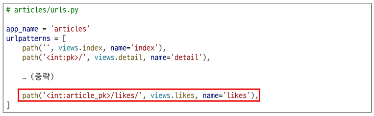
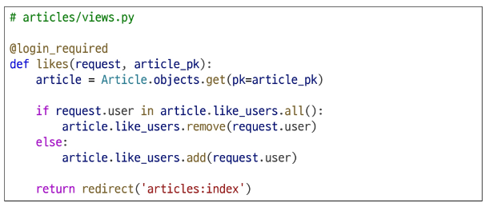
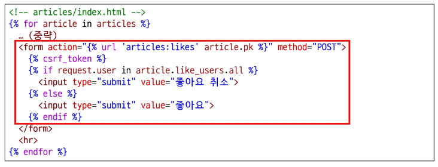

# Many to many relationships

### 다대다 관계 (Many to many relationships)

- **정의**  
  한 테이블의 0개 이상의 레코드가 다른 테이블의 0개 이상의 레코드와 관련된 경우를 의미한다.  
  즉, **한쪽의 여러 개가 다른 쪽의 여러 개와 연결되는 복잡한 관계**이다.

- **예시 개념**  
  영화와 배우의 관계처럼,  
  - 한 영화에는 여러 배우가 출연할 수 있고  
  - 한 배우는 여러 영화에 출연할 수 있다.  
  이러한 경우가 다대다 관계이다.

- **활용**  
  다대다 관계를 설정하면 다음과 같은 작업이 가능하다.  
  - 한 영화에 여러 배우를 쉽게 추가할 수 있다.  
  - 한 배우가 출연한 모든 영화를 쉽게 조회할 수 있다.

- **표기**  
  `N:M` 또는 `M:N` 관계로 표시한다.


### N:M 관계의 역할과 필요성 이해하기

- **병원 진료 시스템 모델 관계 직접 구성하기**  
  - 환자와 의사 2개의 모델을 사용하여 모델 구조를 구상한다.

- **N:1 구조의 한계 확인**  
  기존에 환자와 의사 테이블을 N:1 구조로 구성했을 때 발생하는 한계를 파악한다.

- **N:M 관계 관리 방식 이해**  
  N:M 관계가 데이터베이스 내에서 어떻게 관리되는지를 확인한다.

> 제공된 `99-mtm-practice` 프로젝트를 기반으로 실습을 진행한다.

---

## `N:1`의 한계

### 의사와 환자 간 모델 관계 설정 실습 요약

- **목표**  
  한 명의 의사에게 여러 환자가 예약할 수 있도록 `models` 클래스를 정의한다.  
  `Patient`(환자) 모델이 `Doctor` 모델을 참조하도록 설정한다.

- **데이터베이스 적용**  
  정의한 모델을 `Migration`까지 진행하여 실제 데이터베이스에 반영한다.


- **의사 데이터 생성**  
  Django shell을 활용하여 2명의 의사(`allie`, `barbie`)를 생성한다.  
  생성된 데이터는 데이터베이스 테이블(`hospitals_doctor`)에 저장된다.


- **환자 데이터 생성 및 예약 관계 설정**  
  Django shell을 이용해 2명의 환자(`carol`, `duke`)를 생성하고,  
  각각 서로 다른 의사에게 예약되도록 설정한다.  
  데이터는 `hospitals_patient` 테이블에 저장된다.

---

### N:1의 한계 상황

#### 문제 상황
  `1번 환자(carol)`이 두 의사에게 모두 진료를 받고자 할 때,  
  동일한 환자 데이터가 중복 입력될 수밖에 없는 구조가 된다.  
  즉, 한 환자가 여러 의사를 참조할 수 없어 **데이터 중복 문제가 발생**한다.


- **에러 발생 상황**  
  환자가 여러 의사 정보를 동시에 저장하려고 하면  
  Django에서 **구문 오류(SyntaxError)**가 발생한다.  
  이는 하나의 외래 키(`doctor_id`)에 여러 값을 동시에 지정할 수 없기 때문이다.


- **데이터 중복 및 관리 문제**  
  동일한 환자가 여러 의사에게 진료받기 위해  
  새로운 예약 데이터를 생성하면 환자 정보가 중복 저장된다.  
  이로 인해 데이터 수정 시 모든 중복 데이터를 찾아 수정해야 하는 **비효율**이 발생하며,  
  실수로 누락될 경우 데이터의 **일관성이 깨질 수 있음**.

- **외래 키 제약의 한계**  
  하나의 외래 키 컬럼에 `1, 2` 형태로 여러 값을 저장하는 것은  
  데이터베이스 타입 규칙 위반으로 인해 **불가능**하다.

- **해결 방안**  
  의사 정보와 환자 정보를 각각 외래 키로 참조하는 **별도의 예약 테이블**을 생성함으로써  
  위 문제를 해결할 수 있다.  
  즉, “**예약(Reservation)**” 테이블을 따로 만들어  
  다대다 관계를 구조적으로 표현할 수 있다.


---

## 중개 모델

### 중개 모델

- **정의**  
  다대다 관계에서 두 모델을 연결하는 역할을 하는, 특별한 기능을 가진 모델이다.  
  단순히 두 모델이 연결되었다는 사실뿐 아니라 **연결된 관계에 대한 추가 정보**를 함께 저장할 수 있다.

- **의사-환자 예시**  
  의사와 환자가 ‘예약’이라는 관계로 연결될 때,  
  단순히 “의사 A와 환자 B가 연결되었다”는 것 외에  
  - 언제 예약했는지  
  - 예약의 상태는 무엇인지   
  와 같은 정보를 함께 저장할 수 있다.

- **중개 모델의 역할**  
  중개 모델을 사용하면 `Doctor` 모델이나 `Patient` 모델에는 없는  
  **예약 행위 자체에 대한 세부 정보를 담을 수 있어**,  
  현실 세계의 복잡한 관계를 데이터베이스에서 더 정교하게 표현할 수 있다.

> **TIP**  
> **중개**: 직접 당사자가 되지 않고 거래나 계약이 이루어지도록 돕는 역할 (예: 공인중개사)  
> **중계**: 중간에서 이어받아 다른 곳으로 전달하거나 연결하는 것 (예: 중계 방송)


### 예약 정보 조회

- **의사와 환자의 진료 내역 확인**  
  의사와 환자는 `예약(Reservation)` 모델을 통해 본인의 진료 내역을 조회할 수 있다.  
  이는 중개 테이블의 **역참조(reverse lookup)** 기능을 통해 가능하다.  
  - 의사 → 예약 정보: `doctor.reservation_set.all()`  
  - 환자 → 예약 정보: `patient.reservation_set.all()`  
  두 경우 모두 자신과 연결된 예약 데이터를 확인할 수 있다.


### 추가 예약 생성

- **새로운 환자 예약 추가**  
  기존 의사에게 새로운 환자의 예약을 생성할 수 있다.  
  예를 들어, `1번 의사`에게 `2번 환자`가 추가로 예약되는 경우,  
  예약 테이블(`hospitals_reservation`)에 새로운 행이 추가된다.  
  - `doctor_id = 1`, `patient_id = 2`  
  이를 통해 한 의사는 여러 환자를, 한 환자는 여러 의사를 가질 수 있게 된다.


### 예약 정보 조회 (확장)

- **특정 의사의 전체 예약 목록 확인**  
  역참조를 활용해 한 의사가 보유한 모든 예약 정보를 한 번에 확인할 수 있다.  
  예: `doctor1.reservation_set.all()` →  
  `[Reservation: 1번 의사의 1번 환자, Reservation: 1번 의사의 2번 환자]`

- **핵심 요약**  
  다대다(ManyToMany) 관계에서는 중개 테이블을 이용해 데이터를 효율적으로 관리할 수 있다.  
  Django에서는 `ManyToManyField`를 사용하면  
  두 모델 간의 중개 테이블(중개 모델)이 **자동으로 생성되어 관리**된다.


---


## ManyToManyField

### ManyToManyField()

- **정의**  
  `ManyToManyField()`는 Django에서 **다대다(M:N) 관계를 설정하기 위한 모델 필드**이다.  
  이 필드를 설정하면 Django가 **자동으로 중간 테이블(중개 모델)** 을 생성하여  
  두 모델 간의 관계를 효율적으로 관리한다.

- **특징 요약**  
  - 중개 테이블을 **자동 생성**하므로 별도의 모델을 직접 정의하지 않아도 된다.  
  - 어느 모델에 정의하더라도 관계는 **양방향으로 동일하게 유지**된다.  
  - 필드명은 다대다 관계를 명확히 표현하기 위해 **복수형 명사**를 사용하는 것이 권장된다.  
  - 필수 인자로는 **연결할 대상 모델 클래스**를 지정한다.  

- **활용 개념**  
  예를 들어,  
  한 환자가 여러 의사에게 진료받을 수 있고  
  한 의사도 여러 환자를 진료할 수 있는 경우,  
  `Patient` 모델 또는 `Doctor` 모델 중 한쪽에 `ManyToManyField()`를 선언하면 된다.  
  Django가 자동으로 중개 테이블을 생성하고 이를 통해 두 객체 간 관계를 관리한다.


### ManyToManyField 조작

- **`.add()` 메서드**  
  - 중개 테이블에 **새로운 관계 데이터를 추가**할 때 사용한다.  
  - **여러 객체를 한 번에 추가**할 수도 있다.  
  - 실제 데이터베이스에서는 관계 정보만 새로 추가되며, 기존 데이터는 삭제되지 않는다.

- **`.remove()` 메서드**  
  - 중개 테이블에 저장된 **특정 관계 정보를 제거**할 때 사용한다.  
  - 관계만 해제될 뿐, 대상 객체 자체는 삭제되지 않는다.  
  - 모든 관계를 한 번에 제거하고 싶을 때는 `.clear()` 메서드를 사용할 수 있다.

- **주의점**  
  - `.add()`와 `.remove()`는 **객체 간의 관계만 조작**하며,  
    모델 인스턴스 자체에는 영향을 주지 않는다.  
  - 이는 Django ORM이 데이터베이스를 직접 다루는 것이 아니라  
    **객체(Object)를 중심으로 관계를 관리하는 방식**을 따르기 때문이다.


### 객체 중심(Object-oriented) 관점에서의 이해

- Django ORM은 “데이터베이스 중심”이 아닌 **객체 중심** 구조를 기반으로 한다.  
  즉, 테이블이나 SQL문을 직접 다루지 않고,  
  **모델 클래스와 그 인스턴스(객체)를 통해 관계를 표현**한다.

- `ManyToManyField` 또한 이러한 객체 중심 설계의 일환으로,  
  개발자는 “객체 간의 관계”를 표현하는 코드만 작성하면 된다.  
  Django ORM이 그 관계를 내부적으로 SQL로 변환하여  
  중간 테이블을 자동 생성하고, 데이터 저장 및 조회를 처리한다.

- **장점 요약**  
  - 복잡한 SQL이나 테이블 구조를 몰라도 관계 설정이 가능하다.  
  - 코드가 직관적이고 유지보수가 쉽다.  
  - 객체 간 관계를 그대로 코드에 반영할 수 있어 가독성이 높다.

> 💡 **정리**  
> `ManyToManyField`는 Django ORM이 제공하는 객체 중심적 관계 관리 도구이다.  
> 개발자는 객체 간의 관계를 직관적으로 표현하고,  
> Django는 이를 데이터베이스 수준에서 자동으로 처리한다.  
> 즉, **“객체 중심의 다대다 관계 관리”** 를 구현하는 핵심 기능이다.

---

### 기본 ManyToManyField의 한계

- **저장 정보의 한계**  
  기본 `ManyToManyField`로 생성된 중개 테이블은  
  단순히 **두 모델의 외래 키 정보**만 저장한다.  
  예를 들어, 의사와 환자 관계에서는  
  “어떤 의사와 어떤 환자가 연결되어 있는가”만 알 수 있을 뿐,  
  그 외의 추가적인 정보(예: 예약 날짜, 진료 상태 등)는 포함되지 않는다.

- **추가 정보 저장의 어려움**  
  만약 예약 테이블에 ‘진료 일정’, ‘병의 증상’, ‘예약 상태’, ‘방문 횟수’ 등의  
  **부가 정보를 함께 관리해야 하는 경우**,  
  기본 `ManyToManyField`는 이를 표현할 수 없다.  
  이럴 때는 **사용자가 직접 중개 모델(through 모델)을 정의**해야 한다.

- **직접 중개 테이블 정의 시 주의점**  
  사용자가 직접 중개 모델을 정의하면,  
  기존의 `.add()`나 `.remove()` 메서드는 기본적으로 사용할 수 없다.  
  대신, 중개 모델 인스턴스를 직접 생성하거나 수정하는 방식으로 데이터를 다뤄야 한다.

- **through 속성 활용**  
  `ManyToManyField`에 `through` 속성을 지정하면,  
  사용자가 정의한 중개 모델을 Django가 공식적으로 인식하게 된다.  
  이를 통해  
  - 추가 정보 저장 가능  
  - 기존 `.add()` / `.remove()` 메서드와의 호환성 유지  
  가 가능해진다.

> 💡 **정리**  
> 기본 `ManyToManyField`는 단순한 연결 관계에는 적합하지만,  
> **부가 정보가 필요한 복잡한 관계**를 표현하기 위해서는  
> `through` 속성을 사용한 **사용자 정의 중개 모델**이 필요하다.

---

## 'through' argument

### ManyToManyField의 'through' 속성

- **정의**  
  `'through'` 속성은 **중개 테이블에 추가 데이터를 포함하여**  
  M:N(다대다) 관계를 형성하려는 경우에 사용하는 속성이다.

- **기본 개념**  
  Django의 `ManyToManyField`는 기본적으로 단순한 연결 정보(두 모델의 외래 키)만 저장한다.  
  그러나 관계 자체에 **추가적인 정보(예: 예약일, 상태, 증상 등)** 를 함께 저장해야 할 때는  
  단순한 자동 생성 중개 테이블로는 부족하다.

- **활용 목적**  
  - 중개 테이블(=중개 모델)에 **추가 필드**를 정의하고 싶을 때 사용한다.  
  - 사용자 정의 중개 모델을 `through` 속성으로 연결하면,  
    Django가 해당 모델을 공식적인 M:N 관계 테이블로 인식한다.

- **예시 상황**  
  - 영화와 배우 관계에서 “배역 이름”을 저장해야 할 때  
  - 의사와 환자 관계에서 “예약 날짜”나 “증상 정보”를 기록해야 할 때  
  - 학생과 수업 관계에서 “성적”, “출석률”을 추가로 관리해야 할 때

- **요약**  
  `'through'` 속성은 단순한 관계 연결을 넘어,  
  **관계 자체에 의미 있는 데이터(부가 정보)를 포함**시킬 수 있도록 해주는 기능이다.  
  이를 통해 Django의 다대다 관계를 **더 풍부하고 현실적인 데이터 구조로 확장**할 수 있다.

---

### M:N 관계 주요 사항 정리

- **물리적 구조 변화 없음**  
  M:N 관계를 설정하더라도 두 테이블(예: `Doctor`, `Patient`) 자체에는  
  **물리적인 변화가 발생하지 않는다.**  
  대신 Django가 **중개 테이블을 자동으로 생성**하여  
  두 테이블 간의 관계를 관리한다.

- **ManyToManyField의 역할**  
  `ManyToManyField`는 이러한 중개 테이블을 자동으로 만들어  
  각 모델 간의 연결을 처리한다.  
  따라서 개발자는 데이터베이스 구조를 직접 수정할 필요가 없다.

- **정의 위치의 유연성**  
  `ManyToManyField`는 M:N 관계를 맺는 두 모델 중  
  **어느 한쪽에 정의해도 동일하게 동작**한다.  
  다만, 필드가 정의된 위치에 따라  
  **참조 방향(forward)** 과 **역참조 방향(reverse)** 이 달라질 수 있으므로  
  주의해야 한다.

- **N:1과의 비교**  
  N:1 관계는 **완전한 종속적 관계**로,  
  예를 들어 “한 환자는 한 명의 의사에게만 진료받는다”와 같은 구조를 표현한다.  
  반면 M:N 관계는 **상호적인 관계**로,  
  “의사에게 진찰받는 환자”뿐 아니라  
  “환자를 진찰하는 의사” 형태로도 양방향 표현이 가능하다.

> 💡 **정리**  
> M:N 관계는 두 모델 간의 다대다 연결을 표현하면서도  
> 테이블의 물리적 구조를 변경하지 않는 **논리적 관계 설정 방식**이다.  
> Django의 `ManyToManyField`를 통해  
> 복잡한 관계를 효율적이고 직관적으로 구현할 수 있다.

---

# ManyToManyField

### ManyToManyField 특징

- **정의**  
  `ManyToManyField(to, **options)`는 **M:N 관계를 설정할 때 사용하는 Django 모델 필드**이다.  
  이 필드를 통해 두 모델 간의 다대다 관계를 손쉽게 구성할 수 있다.

- **주요 특징**  
  - M:N 관계 설정 시 Django가 **중개 테이블을 자동 생성**한다.  
  - 어느 모델에서든 관련 객체에 접근할 수 있는 **양방향 관계**를 지원한다.  
  - 동일한 관계는 한 번만 저장되며 **중복되지 않는다.**  
  - 즉, 하나의 연결(예: 특정 의사–환자 관계)은 중복 생성되지 않는다.


### ManyToManyField의 대표 인자 3가지

1. **`related_name`**  
   - 역참조 시 사용할 이름을 변경할 때 사용한다.  
   - 기본적으로는 `{모델명}_set` 형태로 접근하지만, `related_name`을 지정하면 더 명확한 이름으로 참조할 수 있다.  
   - 예: `related_name='patients'` → `doctor.patients.all()`  

2. **`symmetrical`**  
   - 관계의 **대칭 여부를 설정**한다.  
   - 기본값은 `True`이며, 같은 모델 간(M2M 자기참조) 관계일 때 자동으로 양방향 관계를 생성한다.  
   - 예: 친구 관계(Friendship)처럼 서로가 서로를 참조하는 경우에는 `symmetrical=True`가 유용하다.  
   - 반면, 일방향 관계(예: “A가 B를 팔로우한다”)에서는 `symmetrical=False`로 설정한다.

3. **`through`**  
   - 사용자가 직접 생성한 **중개 테이블(모델)** 을 등록할 때 사용한다.  
   - 기본 ManyToMany 관계가 단순한 외래 키 연결만 제공하는 반면,  
     `through`를 사용하면 중개 모델에 **추가 정보(예: 날짜, 상태, 메모 등)** 를 함께 저장할 수 있다.  
   - 예: `through='Reservation'` → 예약 날짜나 증상을 추가로 기록 가능.


> 💡 **정리**  
> `ManyToManyField`는 Django에서 다대다 관계를 구현할 때 가장 강력한 도구로,  
> **양방향 참조**, **중복 방지**, **중개 모델 확장성** 등의 특징을 가진다.  
> 상황에 따라 `related_name`, `symmetrical`, `through` 인자를 적절히 활용하면  
> 데이터 관계를 더욱 명확하고 유연하게 표현할 수 있다.


---

# 좋아요 기능 구현

## 모델 관계 설정

### 다대다 관계 설정

#### Many to many relationships

- **정의**  
  한 테이블의 0개 이상의 레코드가  
  다른 테이블의 0개 이상의 레코드와 관련된 경우를 말한다.

- **특징**  
  - 다대다(M:N) 관계는 **양쪽 모두에서 N:1 관계를 가진 형태**로 구성된다.  
  - 즉, 각 테이블은 서로에게 여러 개의 관련 데이터를 가질 수 있으며,  
    이 관계를 관리하기 위해 Django에서는 `ManyToManyField`를 사용한다.

- **예시 개념**  
  - 한 사용자가 여러 게시글에 ‘좋아요’를 누를 수 있고,  
  - 한 게시글도 여러 사용자로부터 ‘좋아요’를 받을 수 있다.  
  → 이러한 경우가 전형적인 **다대다(M:N) 관계**이다.

- **핵심 요약**  
  `ManyToManyField`를 통해 두 모델 간의 다대다 관계를 쉽게 구현할 수 있으며,  
  Django는 내부적으로 중개 테이블을 자동 생성하여 관계를 효율적으로 관리한다.

---

### 좋아요 기능의 모델 관계 설정

- **Article(M) - User(N)**  
  - 게시글(Article)은 좋아요가 없을 수도 있고, 여러 개 존재할 수도 있음.  
  - 사용자(User) 역시 여러 개의 게시글에 좋아요를 누를 수 있음.  
  → 즉, **게시글과 사용자 간에는 다대다(M:N) 관계**가 성립한다.

- **ManyToManyField 작성**  
  - `Article` 모델 내부에서 `ManyToManyField`를 사용하여 사용자 모델과 연결한다.  
  - 이 필드는 Django의 `settings.AUTH_USER_MODEL`을 참조해,  
    현재 프로젝트의 사용자 모델(`User`)과 관계를 맺는다.  
  - 코드 예시에서는 `like_users` 필드를 정의해  
    특정 게시글을 좋아요한 사용자 목록을 저장하도록 설정한다.

- **Migration 과정 중 오류 발생 확인**  
  `python manage.py makemigrations` 실행 시,  
  역참조 이름(`related_name`)이 충돌하는 오류가 발생할 수 있다.  

- **오류 원인**  
  Django는 역참조 시 기본적으로 `<모델명>_set` 이름을 사용한다.  
  그런데 `Article` 모델 내에 이미 `user` 필드가 존재하기 때문에,  
  `like_users`의 역참조 이름이 `User.article_set`과 **중복 충돌**하게 된다.


---

### 역참조 매니저 충돌

- **ForeignKey의 역참조**  
  - 게시글의 작성자를 저장하기 위해 `ForeignKey`를 사용하면,  
    Django는 기본적으로 `article_set`이라는 이름의 역참조 매니저를 생성한다.  
  - 예: 사용자가 작성한 게시글을 확인하기 위해 `user.article_set.all()` 사용.

- **ManyToManyField의 역참조**  
  - 좋아요 기능을 구현하기 위해 `ManyToManyField`를 추가하면,  
    Django는 동일하게 `article_set`이라는 기본 역참조 이름을 생성한다.  
  - 예: 사용자가 좋아요한 게시글을 확인하기 위해 `user.article_set.all()` 사용.

- **충돌 원인**  
  - `ForeignKey`와 `ManyToManyField`가 **동일한 역참조 이름(`article_set`)** 을 사용하면서  
    Django가 어떤 데이터를 참조해야 하는지 구분할 수 없게 된다.  
  → 이로 인해 **역참조 이름 충돌 오류**가 발생한다.


- **문제 요약**  
  - `User`와 `Article` 모델 사이에  
    `ForeignKey(작성자)`와 `ManyToManyField(좋아요)` 두 관계가 공존하면,  
    Django는 동일한 이름(`article_set`)을 두 관계에 모두 할당하게 된다.  
  - 이때 “`user.article_set`은 작성한 글인가, 좋아요한 글인가?”를 구분할 수 없게 되어  
    **모호성 에러**가 발생한다.

- **해결 방법**  
  - 두 관계 중 하나에 `related_name`을 지정하여 이름을 구분해야 한다.  
  - 일반적으로 **ManyToManyField 쪽에 `related_name`을 추가**하는 것을 권장한다.  
  - 예:  
    ```python
    like_users = models.ManyToManyField(
        settings.AUTH_USER_MODEL,
        related_name='like_articles'
    )
    ```
  - 이렇게 하면 다음과 같이 명확히 구분된다.  
    - 사용자가 작성한 글 → `user.article_set.all()`  
    - 사용자가 좋아요한 글 → `user.like_articles.all()`

> 💡 **정리**  
> 역참조 충돌은 Django에서 두 관계가 같은 이름의 역참조 매니저를 가질 때 발생한다.  
> `related_name`을 통해 명확히 구분하면 충돌을 방지하고,  
> 관계의 의미를 명확히 표현할 수 있다.


---

### 충돌 해결하기

- **역참조 충돌 상황 정리**  
  - `user.article_set.all()` → 사용자가 **작성한 모든 글**을 조회 (소유 관계, 기본값)  
  - `user.like_articles.all()` → 사용자가 **좋아요를 누른 모든 글**을 조회 (행위 관계, 명시적 설정)

- **핵심 설계 원칙**  
  - 핵심적인 **소유 관계(N:1)** 는 기본값(`article_set`)을 유지한다.  
  - 부가적인 **행위 관계(M:N)** 는 명시적인 이름(`like_articles`)을 지정하여 구분한다.  
  - 즉, **“소유는 기본값 / 행위는 구체적 이름”** 원칙으로 관계를 설계하면 충돌을 방지할 수 있다.


- **해결 과정 요약**  
  1. `ManyToManyField`에 `related_name` 인자를 추가하여  
     역참조 이름이 중복되지 않도록 수정한다.  
  2. 수정 후 `makemigrations`와 `migrate`를 다시 수행한다.  
  3. Django가 새롭게 생성한 **중개 테이블**이 정상적으로 적용되었는지 확인한다.

- **결과**  
  - `ForeignKey`와 `ManyToManyField`의 역참조 이름이 명확히 분리되어  
    더 이상 충돌이 발생하지 않는다.  
  - 데이터 관계를 `user.article_set`(작성한 글)과  
    `user.like_articles`(좋아요한 글)로 직관적으로 구분할 수 있게 된다.


---

### User - Article 간 사용 가능한 전체 related manager

- **`article.user`**  
  - 게시글을 작성한 사용자 정보  
  - 관계 유형: **N:1 (소유 관계)**  
  - 한 사용자는 여러 게시글을 작성할 수 있지만,  
    하나의 게시글은 오직 한 명의 사용자에게 속한다.

- **`user.article_set`**  
  - 사용자가 작성한 모든 게시글 목록 (역참조)  
  - 관계 유형: **N:1 (역참조 관계)**  
  - Django가 자동으로 생성하는 기본 related manager이다.

- **`article.like_users`**  
  - 게시글에 좋아요를 누른 사용자 목록  
  - 관계 유형: **M:N (다대다 관계)**  
  - 하나의 게시글에는 여러 사용자가 좋아요를 누를 수 있다.

- **`user.like_articles`**  
  - 사용자가 좋아요를 누른 모든 게시글 목록 (역참조)  
  - 관계 유형: **M:N (다대다 역참조 관계)**  
  - `related_name='like_articles'`로 명시적으로 지정한 이름이며,  
    사용자가 좋아요한 게시글을 직관적으로 조회할 수 있다.

> 💡 **정리**  
> `ForeignKey`는 **소유 관계(N:1)** 를 표현하고,  
> `ManyToManyField`는 **행위 관계(M:N)** 를 표현한다.  
> 이 두 관계를 명확히 구분하여 related manager를 적절히 활용하면,  
> Django ORM에서 객체 간 관계를 효율적으로 탐색할 수 있다.


---

## 기능 구현





