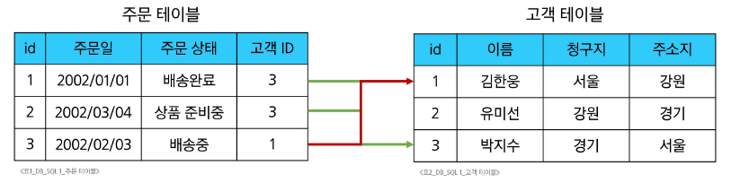
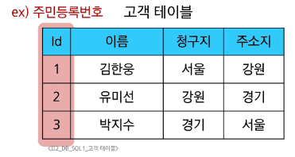
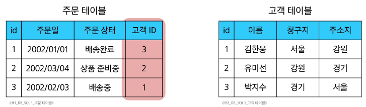
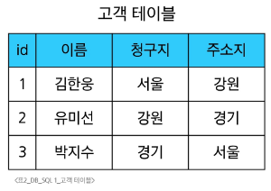
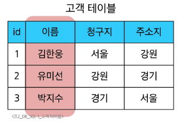
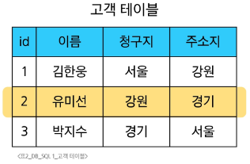
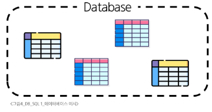
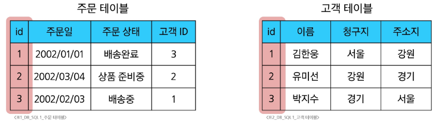
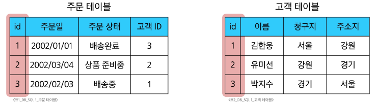
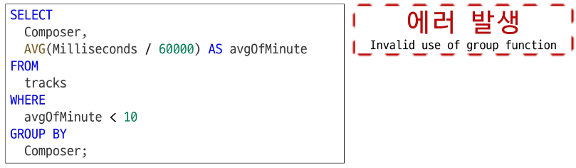

# Database

## Database란?

**체계적으로 정리된 데이터의 모음**  
> - 책장을 예로 들면, 무작위로 쌓인 책이 아닌 **주제별/작가별로 정리된 서가**처럼  
> - 컴퓨터가 수많은 정보를 빠르게 찾고 효율적으로 관리하도록 돕는 시스템  
> - 즉, 데이터를 구조적으로 저장·관리하는 장치 

### 데이터(Data)란?
- 저장이나 처리를 위해 변환된 정보  
- 우리가 표현한 정보를 **컴퓨터가 다룰 수 있도록 구조화**한 것이 데이터  
- 분석, 계산, 저장을 위해 정보를 구체적인 형태로 정리한 것  

### 데이터의 중요성과 증가

- 데이터 사용량 증가
  - **배달의민족**: 2022년 한 해 동안 **11억 1천만 건 이상 주문 처리**  
  - **유튜브**: 1분마다 **500시간 이상**의 새로운 영상 업로드  
  - **넷플릭스**: 구독자 3억 명 돌파(2024), 2025년 상반기 기준 **약 950억 시간 시청 예상**  
  - **IBM**: 전 세계 데이터의 **90%가 2015년 이후 생산**

- 데이터 센터의 성장
  - **네이버**: 제2데이터센터에 **6,500억 원 투자 (2020)**  
  - **카카오**: 제1·제2데이터센터에 **1.5조 원 투자 (2022)**  

  > 💬 전 세계 데이터센터 시장은 2024~2029년 동안 연평균 **11.13% 성장**  
  > 2029년 약 **4,386억 8천만 달러 규모** 도달 예상  
  > (출처: *Mordor Intelligence, "Data Center Market Size & Share Analysis"*)

- 데이터 관리의 중요성
  - 데이터를 단순히 저장하는 것이 아니라,  
    **잘 관리하고 효율적으로 활용할 수 있는 기술**이 중요  
  - 데이터센터는 방대한 정보를 저장·관리하기 위한 핵심 인프라로 성장 중  
  - 앞으로의 기술 경쟁력은 **데이터를 얼마나 잘 저장·분석·활용하느냐**에 달려 있음  

---

### 데이터 저장 방식

#### 1. 파일(File) 이용
- 어디서나 쉽게 사용 가능  
- 하지만 **데이터를 구조적으로 관리하기 어려움**

- 📂 **예시: `개인정보.txt`**
  ```txt
  이름: 김한용
  나이: 56
  사는 곳: 서울

  이름: 유미선
  나이: 21
  사는 곳: 강원

  이름: 박지수
  나이: 36
  사는 곳: 경기
  ```
- 사람이 읽기엔 쉬우나, 컴퓨터가 원하는 형태(열·행 단위)로 관리하기 어려움  
- 검색, 수정, 추가가 비효율적이며 **데이터의 일관성 유지가 어려움**

#### 2. 스프레드시트(Spreadsheet) 이용
- **테이블 형태(행과 열)**로 데이터를 구조적으로 관리 가능  
- 예: Excel, Google Sheets 등  

📊 **예시 테이블**

| id | name   | age | city |
|----|--------|-----|------|
| 1  | 김한용 | 56  | 서울 |
| 2  | 유미선 | 21  | 강원 |
| 3  | 박지수 | 36  | 경기 |

- 데이터 간 비교, 필터링, 정렬이 용이  
- 간단한 분석 작업도 가능하여 **파일보다 구조화된 형태의 저장 방식**

---

### 스프레드시트의 한계

| 구분 | 내용 |
|------|------|
| **크기 제한** | 약 100만 행까지만 저장 가능 |
| **보안** | 단순히 파일/링크 소유 여부로 접근 권한 관리 |
| **정확성** | <ul><li>예: “강원” → “강언”으로 변경 시, 모든 시트의 값을 직접 수정해야 함</li><li>데이터가 여러 시트에 분산되어 있으면 누락·불일치 가능</li></ul> |

---

### 데이터베이스 역할

#### ✅ CRUD
데이터베이스는 데이터를 효율적으로 저장하고 관리하기 위해 다음 네 가지 기본 기능을 수행한다.  
이를 **CRUD**라고 하며, 각각의 기능은 다음과 같다.

| 구분 | 기능 설명 | 예시 |
|------|------------|------|
| **Create (생성)** | 새로운 데이터를 데이터베이스에 추가 | 새로운 회원 등록 |
| **Read (조회)** | 기존 데이터를 검색하거나 읽기 | 특정 회원 정보 조회 |
| **Update (수정)** | 저장된 데이터를 변경 | 회원의 주소나 연락처 수정 |
| **Delete (삭제)** | 불필요한 데이터를 삭제 | 탈퇴한 회원 정보 삭제 |

이 네 가지 기능을 통해 데이터베이스는  
데이터의 **입력 → 조회 → 수정 → 삭제** 과정을 체계적으로 관리하며  
프로그램이나 서비스가 데이터를 일관성 있게 다룰 수 있도록 지원한다.


---

# Relational Database

## Relational Database란?

### 데이터베이스의 역할

데이터베이스는 데이터를 단순히 저장하는 것을 넘어,  
**구조적으로 <u>저장</u>하고 조작할 수 있는 기능**을 제공한다.  
이러한 조작 기능은 **CRUD(Create, Read, Update, Delete)** 네 가지로 구성된다.

---

### 관계형 데이터베이스 (Relational Database)

- **데이터 간에 관계가 있는 데이터 항목들의 모음**
- 데이터를 테이블(표) 형태로 관리하며, 서로 **연결된 관계**를 통해 데이터를 효율적으로 다룬다.

  > #### 병원 예시로 이해하기
  > - 환자 정보는 한 종이에, 진료 기록은 다른 종이에 작성되어 있다고 가정.  
  > - 이름이 같은 환자가 여러 명이라면, 진료 기록만 보고 누가 누군지 구분하기 어렵다.  
  > - 병원에서는 이를 해결하기 위해 **환자마다 고유 번호(예: 환자번호)**를 > 부여한다.  
  > - 진료 기록에는 이 번호를 함께 적어 **정확한 연결(관계)**이 가능해진다.

- 즉, **관계형 데이터베이스는 각 데이터를 고유 식별자(Primary Key)**로 구분하고    
이를 통해 서로 다른 테이블 간의 데이터를 연결한다.

---

### 관계형 데이터베이스의 구조

#### 기본 구조
- 데이터를 **테이블(행과 열)** 형태로 구조화하여 저장  

- 서로 관련된 데이터 간의 연결 관계를 **포인터(키 값)**로 관리  

- 이를 통해 **액세스(Access)** 권한을 제공하고, 데이터를 함께 조회 가능하게 함

  

### 관계(Relationship)

- 관계는 **여러 테이블 간의 논리적 연결**을 의미한다.  
- 데이터를 여러 테이블로 나누어 저장하되,  
  공통된 키 값(예: 고객 ID, 환자번호 등)을 통해 **서로 연결**한다.  
- 이를 통해 필요할 때 두 테이블의 데이터를 함께 조회하거나 조작할 수 있다.

> 예를 들어, 고객 ID를 기준으로  
> “특정 날짜에 구매한 고객 정보”나  
> “지난 달 배송이 지연된 고객 목록”을 조회할 수 있다.

---

### 관계를 통한 활용

- 관계를 사용하면 **여러 테이블을 동시에 활용**할 수 있다.  
- 예시:
  - 특정 날짜에 주문한 고객 정보 조회  
  - 지난 달 배송이 지연된 고객 목록 확인  
- 이러한 조회는 각 테이블의 **공통된 키 값**을 통해 이루어진다.

| 주문 테이블 | 연결 기준 | 고객 테이블 |
|--------------|-----------|--------------|
| 주문 정보 | 고객 ID | 고객 정보 |

결과적으로, 관계형 데이터베이스는  
데이터를 **분리하여 저장하면서도, 논리적으로 연결된 형태로 관리**할 수 있도록 돕는다.


### 관계형 데이터베이스 예시

#### 1) 고유 식별자의 필요성

- 다음과 같이 고객 데이터가 테이블에 저장되어 있다고 가정한다.  
- 고객 데이터를 비교하거나 특정 고객을 식별하려면 어떤 값을 사용해야 할까?

| 이름 | 청구지 | 주소지 |
|------|--------|--------|
| 김한용 | 서울 | 강원 |
| 유미선 | 강원 | 경기 |
| 박지수 | 경기 | 서울 |

- 단순히 **이름이나 주소만으로는 중복될 수 있음**  
  → 동명이인, 같은 지역 거주자 등이 존재할 수 있음  
- 따라서 **각 데이터를 고유하게 구분할 수 있는 값이 필요**

---

#### 2) 기본 키 (Primary Key)

- 각 데이터에 **고유한 식별자(Primary Key)** 를 부여하여 구분  
- 이는 중복되지 않고, 각 행(Row)을 식별할 수 있는 기준이 됨  
- 예를 들어 주민등록번호, 학번, 고객 ID 등이 기본 키가 될 수 있음

  

→ `Id` 열이 **기본 키(Primary Key)** 역할을 수행하며,  
모든 데이터는 이 키를 통해 유일하게 식별된다.


---

#### 3) 테이블 간 관계 형성의 필요성

- 고객이 주문을 한다고 가정하면, 주문 정보를 별도의 **주문 테이블**에 저장할 수 있다.  
- 하지만 "누가 주문했는지"를 알아내기 위해서는 고객과 주문 간 연결이 필요하다.  

| 주문 테이블 |  | 고객 테이블 |
|--------------|--|--------------|
| id, 주문일, 주문상태 | → | id, 이름, 청구지, 주소지 |

- 고객 이름을 기준으로 연결하면 **동명이인 문제** 발생  
  → 따라서 **고유 식별자(Primary Key)** 를 이용해야 함

---

#### 4) 외래 키 (Foreign Key)

- 주문 정보에 고객의 고유 식별 값을 저장함으로써  
  두 테이블을 연결할 수 있다.  
- 이렇게 다른 테이블의 기본 키를 참조하는 값을 **외래 키(Foreign Key)** 라고 한다.

  

- `고객 ID`는 주문 테이블에서 **외래 키(Foreign Key)** 로 사용되며,  
  고객 테이블의 **기본 키(Primary Key)** 인 `id`를 참조한다.

---

### 관계형 데이터베이스 관련 키워드

#### 1) Table (Relation)
- 데이터를 **기록하는 곳**
- 하나의 테이블은 특정 주제나 개체(Entity)의 정보를 담고 있음  
  예: 고객 테이블, 주문 테이블 등  

  

#### 2) Field (Column, Attribute)
- 테이블의 **열(Column)** 에 해당하며, 데이터의 속성이나 항목을 정의  
- 각 필드에는 **고유한 데이터 형식(Type)** 이 지정됨  
  예: `id(INT)`, `이름(VARCHAR)`, `청구지(VARCHAR)` 등  

  

#### 3) Record (Row, Tuple)
- 테이블의 **행(Row)** 에 해당하며, 구체적인 데이터 값이 저장된 단위  
- 각 레코드는 하나의 개체(instance)를 나타냄  

  

즉, **한 줄(레코드)** 은 하나의 실제 데이터를 의미한다.


#### 4) Database (Schema)
- 여러 개의 **테이블을 모아놓은 집합**
- 즉, 관계형 데이터베이스 시스템에서 **하나의 논리적 단위**
- 데이터베이스 내부에는 여러 테이블이 존재하며,  
  이들은 서로 **키(Key)** 를 통해 관계를 맺는다.  

- 예: 회원관리 DB 안에  
→ 회원 테이블 / 주문 테이블 / 결제 테이블 / 상품 테이블 등이 존재
  


#### 5) Primary Key (기본 키, PK)
- 각 레코드의 **고유한 값**으로,  
  테이블 내에서 **레코드를 식별하기 위한 기준 키**  
- 중복 불가, Null 값 불가  
- 관계형 데이터베이스에서는 **다른 테이블과 연결 시 기준**이 된다.  

  

→ 고객 테이블의 **id** 컬럼이 기본 키 역할 수행


#### (6/6) Foreign Key (외래 키, FK)
- **다른 테이블의 기본 키(Primary Key)** 를 참조하는 키  
- 두 테이블 간 **관계를 연결**하는 데 사용됨  
- 한 테이블의 특정 열이 다른 테이블의 PK 값을 참조함으로써  
  **데이터의 논리적 연결**을 가능하게 함  

  

- 주문 테이블의 `고객 ID` → 고객 테이블의 `id`를 참조  
- 즉, 외래 키는 **테이블 간 관계를 만드는 연결점**


### 정리

| 용어 | 다른 이름 | 설명 |
|------|------------|------|
| **Table** | Relation | 데이터를 저장하는 표 단위 |
| **Field** | Column, Attribute | 데이터의 속성(열) |
| **Record** | Row, Tuple | 실제 데이터(행) |
| **Database** | Schema | 테이블의 집합 |
| **Primary Key** | PK | 테이블 내 데이터의 고유 식별자 |
| **Foreign Key** | FK | 다른 테이블과 관계를 맺는 연결 키 |

---

## RDBMS

### DBMS (Database Management System)

#### 정의
- **데이터베이스를 관리하는 소프트웨어 프로그램**
- 컴퓨터 내부에서 ‘정리된 서류함’과 같은 역할을 수행
- 데이터를 일정한 규칙으로 저장하고, 필요할 때 쉽게 꺼내거나 수정할 수 있도록 도와주는 도구

#### 특징
- 데이터를 효율적으로 **저장 및 관리**할 수 있도록 함  
- 데이터베이스와 사용자 사이에서 **인터페이스 역할** 수행  
- 사용자는 DBMS를 통해  
  데이터 **구성, 수정(Update), 모니터링, 백업, 복구** 등의 작업을 수행할 수 있음  

---

### RDBMS (Relational Database Management System)

#### 정의
- **관계형 데이터베이스를 관리하는 소프트웨어 프로그램**  
- 여러 개의 테이블을 나누어 저장하고,  
  **공통된 키(Key)** 를 통해 테이블 간의 관계를 관리하도록 지원하는 시스템  

#### 도서관 예시로 이해하기
- 도서관의 대출 시스템을 예로 들면:
  - 책은 **도서 목록 테이블**
  - 사람은 **회원 명단 테이블**
  - 대출 내역은 **대출 기록 테이블**
- 세 테이블은 서로 다른 정보를 가지고 있지만,  
  **회원 번호**와 **책 번호**를 통해 서로 연결되어 있음
- RDBMS는 이렇게 여러 테이블 간의 관계를 관리하여  
  **데이터의 일관성 및 참조 무결성**을 유지함

---

### RDBMS 서비스 종류

- **SQLite**  
  - 가볍고 파일 기반으로 동작  
  - 소형 프로젝트나 모바일 앱에서 주로 사용  

- **MySQL**  
  - 오픈소스 RDBMS로, 웹 애플리케이션(예: 워드프레스, PHP)에서 많이 사용  
  - 빠르고 안정적인 성능  

- **PostgreSQL**  
  - 오픈소스이면서 **확장성**과 **표준 준수**가 뛰어난 DBMS  
  - 대규모 시스템이나 고급 기능(SQL 표준, JSON 등)을 요구하는 환경에 적합  

- **Oracle Database**  
  - 상용 DBMS의 대표격  
  - 대기업, 금융권 등 **트랜잭션 안정성과 보안**이 중요한 곳에서 주로 사용  

> 프로젝트의 목적과 환경에 따라 **적절한 RDBMS를 선택**하는 것이 중요하다.  
> RDBMS는 모두 SQL을 기반으로 작동하지만,  
> 세부 기능과 사용 방식은 다르므로 프로젝트 특성에 맞는 도구를 고르는 것이 핵심이다.

### 데이터베이스 정리

- **Table**은 데이터를 기록하는 곳  
  → 하나의 테이블은 특정 주제(예: 고객, 주문, 상품 등)에 대한 정보를 저장한다.  

- **Table**에는 각 행(Row)을 고유하게 식별할 수 있는 **기본 키(Primary Key)** 가 존재한다.  
  → 기본 키는 중복되지 않으며, 데이터를 유일하게 구분할 수 있게 해준다.  

- **외래 키(Foreign Key)** 를 사용하면  
  서로 다른 테이블 간에 **관계(Relationship)** 를 설정할 수 있다.  
  → 예: 주문 테이블의 고객 ID가 고객 테이블의 ID를 참조하여 연결  

- 데이터는 기본 키 또는 외래 키를 통해  
  여러 테이블 간에 **결합(Join)** 될 수 있다.  
  → 이를 통해 관계형 데이터베이스는 다양한 형태의 데이터를  
  **논리적으로 연결된 구조로 관리**할 수 있다.

---


# SQL

## SQL(Structured Query Language)이란?

- **SQL**은 테이블 형태로 **구조화된 관계형 데이터베이스**에 **요청(Query)** 을 보내는 언어이다.  
- 즉, 사용자가 DBMS에게 “내가 원하는 데이터를 찾아달라” 혹은 “이 데이터를 수정·삭제·추가해달라”라고 명확히 지시하기 위한 **표준화된 요청 형식**이다.  

>#### 도서관 비유
>- 데이터베이스를 ‘도서관’에 비유하면,  
  SQL은 **사서에게 책을 찾거나 정리해달라고 요청하는 문서**와 같다.  
  예: “2000년 이후 출판된 과학 소설 중, 책 제목과 저자 정보를 최신순으로 정렬해서 보여주세요.”  

→ 즉, SQL은 모호한 말이 아닌 **명확하게 약속된 문법과 형식**에 따라 데이터베이스에 명령을 내리는 언어이다.

---

### SQL Syntax (기본 문법)

```sql
SELECT column_name 
FROM table_name;
```
1. SQL 키워드

    - 대소문자를 구분하지 않는다.

    - 하지만 가독성을 위해 키워드는 대문자로 작성하는 것을 권장한다.

    - 예: `SELECT`, `FROM`, `WHERE` 등

2. 세미콜론( ; ) 사용

    - 각 SQL 명령문(Statement)의 끝에는 세미콜론( ; ) 을 붙인다.

    - 이는 여러 명령문을 구분하기 위한 마침표 역할을 한다.
      ```sql
      SELECT * FROM customers;
      SELECT * FROM orders;
      ```

#### 핵심 요약
| 구분            | 설명                            |
| ------------- | ----------------------------- |
| **SQL**       | 관계형 데이터베이스와 소통하기 위한 표준 질의 언어  |
| **SELECT 문법** | 테이블에서 데이터를 조회하기 위한 기본 구조      |
| **키워드 표기 규칙** | 대소문자 구분 없음, 가독성을 위해 대문자 사용 권장 |
| **세미콜론( ; )**   | SQL 명령문 종료 기호                 |

## SQL Statements

- **SQL Statements**란 SQL을 구성하는 가장 기본적인 **명령 코드 블록**이다.  
- 각 Statement는 데이터베이스에 특정 작업을 수행하도록 요청하는 하나의 단위 명령문이다.  

#### 예시
```sql
SELECT column_name FROM table_name;
```
- 위 예시는 SELECT Statement라고 부르며,
`SELECT`, `FROM` 두 개의 키워드로 구성되어 있다.

### 수행 목적에 따른 SQL Statements 4가지 유형

| 구분 | 전체 명칭 | 역할 | 주요 SQL 키워드 |
|------|------------|------|----------------|
| **DDL** | Data Definition Language | 데이터의 기본 구조 및 형식 정의·변경 | `CREATE`, `DROP`, `ALTER` |
| **DQL** | Data Query Language | 데이터 검색 및 조회 | `SELECT` |
| **DML** | Data Manipulation Language | 데이터 조작 (추가, 수정, 삭제) | `INSERT`, `UPDATE`, `DELETE` |
| **DCL** | Data Control Language | 데이터 및 작업에 대한 권한 제어 | `COMMIT`, `ROLLBACK`, `GRANT`, `REVOKE` |

---

### SELECT Statement 실행 순서

#### 실행 단계
1. **FROM** — 데이터를 가져올 **테이블 지정**  
2. **SELECT** — 테이블에서 **조회할 컬럼 선택**  
3. **ORDER BY** — 조회된 데이터를 **정렬**

#### 설명
- SQL 문장은 작성 순서(`SELECT → FROM → ORDER BY`)와 실제 실행 순서가 다르다.  
- 실제 실행은 **FROM → SELECT → ORDER BY** 순으로 진행된다.  
  즉, **데이터를 가져온 뒤(FROM)**, **필요한 컬럼을 선택하고(SELECT)**, **결과를 정렬(ORDER BY)** 하는 과정으로 수행된다.

#### 요약
| 단계 | 키워드 | 역할 |
|------|---------|------|
| 1 | FROM | 어떤 테이블에서 데이터를 가져올지 지정 |
| 2 | SELECT | 가져온 데이터 중 어떤 컬럼을 조회할지 선택 |
| 3 | ORDER BY | 결과를 특정 기준에 따라 정렬 |

# Filtering Data (데이터 필터링)

- **Filtering data**는 테이블 내의 전체 데이터 중 **특정 조건을 만족하는 데이터만 선택**하기 위한 과정이다.  
- 이를 위해 SQL에서는 **Clause(절)** 과 **Operator(연산자)** 를 함께 사용한다.


### Clause (절)

- SQL 문장에서 특정 기능을 수행하도록 지정하는 문장 구성 요소  
- 데이터를 **제한하거나(WHERE)**, **중복 제거(DISTINCT)**, **출력 개수 제한(LIMIT)** 등의 역할을 수행한다.  

| Clause | 설명 |
|---------|------|
| **DISTINCT** | 중복된 데이터를 제거하고 고유한 값만 조회 |
| **WHERE** | 특정 조건을 만족하는 행만 선택 |
| **LIMIT** | 출력되는 행(Row)의 개수를 제한 |


### Operator (연산자)

- SQL에서 조건을 비교하거나 데이터를 선택하기 위해 사용하는 **명령 키워드 또는 기호**  
- WHERE 절 내에서 자주 사용되며, 값의 범위·일치 여부·패턴 등을 비교하는 데 활용된다.

| Operator | 설명 |
|-----------|------|
| **BETWEEN** | 값의 범위를 지정 (예: 10과 20 사이) |
| **IN** | 지정된 여러 값 중 하나와 일치하는 데이터 선택 |
| **LIKE** | 특정 패턴(문자열 포함 여부 등)을 기준으로 검색 |
| **Comparison** | 비교 연산자 (=, <>, >, < 등)로 값 비교 |
| **Logical** | 논리 연산자 (AND, OR, NOT)로 조건 결합 |


---

## DISTINCT

### 개요
- **DISTINCT**는 SQL에서 **조회 결과의 중복된 레코드를 제거**할 때 사용하는 키워드이다.  
- 동일한 값이 여러 번 나타나는 컬럼에서 **고유한(Unique) 값만 추출**할 수 있다.  


### 특징
- `DISTINCT`는 **`SELECT` 키워드 바로 뒤**에 작성해야 한다.  
- 중복을 제거할 컬럼(필드)을 하나 이상 지정할 수 있다.  
- 여러 컬럼을 지정하면, **모든 컬럼 조합이 동일한 경우**에만 중복으로 간주된다.  


### 예시 개념
- 예를 들어, 고객의 지역 데이터에서 “서울, 부산, 서울, 대구”가 있다면,  
  중복을 제거하면 “서울, 부산, 대구”만 남는다.  
- 즉, DISTINCT는 **데이터의 고유 항목만 남기기 위한 필터 역할**을 수행한다.  


### 핵심 요약
| 구분 | 설명 |
|------|------|
| **기능** | 중복된 데이터를 제거하고 고유한 값만 조회 |
| **위치** | SELECT 키워드 바로 뒤 |
| **사용 목적** | 데이터의 고유 항목 확인 또는 요약 |
| **주의점** | 여러 컬럼 지정 시 모든 컬럼의 조합이 동일한 행만 중복으로 판단 |


#### 추가 정리
- DISTINCT는 **데이터의 다양성을 파악하거나, 중복 데이터 제거 전 확인 작업**에 자주 사용된다.  
- 단, 중복 검사를 수행하므로 **대용량 데이터에서는 성능 저하가 발생할 수 있음**을 유의해야 한다.

---

## WHERE

### 개요
- **WHERE 절**은 SQL에서 **특정 조건에 맞는 데이터만 조회**하기 위해 사용된다.  
    - 파이썬으로 치면, `if`문에 해당된다!
- 즉, 전체 데이터 중 **필요한 행(Row)만 선별(filtering)** 하는 역할을 한다.  


### 특징
- WHERE 절은 **FROM 절 바로 뒤에 위치**한다.  
- 조건식(`search_condition`)에는 **비교 연산자**와 **논리 연산자**가 함께 사용된다.  
  - 비교 연산자: `=`, `>`, `<`, `>=`, `<=`, `<>` 등  
  - 논리 연산자: `AND`, `OR`, `NOT` 등  
- 여러 조건을 동시에 지정할 수 있으며, 논리 연산자를 이용해 조건을 결합할 수 있다.  


### 예시 개념
- 예를 들어, 직원 테이블에서 “급여가 3000 이상인 직원만” 조회하고 싶다면,  
  WHERE 절을 사용해 조건을 지정할 수 있다.  
- 여러 조건을 조합하면 “부서가 영업이고 급여가 3000 이상인 직원”처럼 **복합 조건 검색**도 가능하다.  


### 핵심 요약
| 구분 | 설명 |
|------|------|
| **기능** | 조회 시 특정 조건을 지정해 필요한 데이터만 선택 |
| **위치** | FROM 절 바로 뒤 |
| **구성 요소** | 비교 연산자, 논리 연산자, 조건식 |
| **활용** | 특정 값, 범위, 조건을 만족하는 데이터 검색 |


### 추가 정리
- WHERE 절은 **데이터 필터링의 핵심 구문**으로,  
  다른 SQL 절(예: ORDER BY, GROUP BY 등)과 함께 자주 사용된다.  
- 복잡한 검색 조건일수록 **논리 연산자(AND, OR, NOT)** 의 우선순위를 명확히 지정하는 것이 중요하다.

### NULL 비교


#### SQL의 3값 논리
- SQL은 논리 연산 시 세 가지 값을 사용한다.  
  1. **TRUE (참)**  
  2. **FALSE (거짓)**  
  3. **UNKNOWN (알 수 없음)**  
- 예를 들어 `NULL = NULL` 의 결과는 TRUE가 아닌 **UNKNOWN**이다.  
  → 두 NULL이 실제로 어떤 값을 가지는지 알 수 없기 때문.  


#### 값의 부재와 불확실성
- NULL은 “값이 존재하지 않음”을 의미하므로 특정 값과 동일하다고 볼 수 없다.  
- `=` 연산자를 사용하여 비교하면 항상 UNKNOWN이 되어 **예상한 결과를 얻지 못함**.  


#### 명시적 비교: IS / IS NOT
- SQL 표준은 NULL 비교 시 **IS NULL** 또는 **IS NOT NULL** 구문을 사용하도록 규정한다.  
- `WHERE column IS NULL` → 해당 컬럼의 값이 존재하지 않는 행을 검색  
- `WHERE column IS NOT NULL` → 값이 존재하는 행을 검색  
- 이 구문을 통해 NULL 여부를 명확하게 판별할 수 있다.  


#### = 와 IS 비교
| 비교 방식 | 설명 |
|------------|------|
| `=` | 일반적인 값의 동등성(같음)을 비교할 때 사용. 단, NULL과 비교 시 결과는 UNKNOWN. |
| `IS` | NULL과 같은 **특수한 값**을 비교할 때 사용. NULL 또는 Boolean 값을 비교할 때 활용. |


#### 핵심 요약
| 구분 | 설명 |
|------|------|
| **NULL의 의미** | 값이 존재하지 않거나 알 수 없음을 표현 |
| **비교 불가 이유** | NULL은 값이 아니므로 일반 연산자(=, <, > 등)로 비교 불가 |
| **비교 방법** | IS NULL / IS NOT NULL 사용 |
| **논리 체계** | TRUE / FALSE / UNKNOWN의 3값 논리를 가짐 |


#### 추가 정리
- NULL은 “0”이나 “빈 문자열(‘’)”과는 다르며, **데이터 자체가 존재하지 않음**을 의미한다.  
- 데이터베이스 설계 시 NULL 값의 의미와 처리 방식을 명확히 정의하는 것이 중요하다.


## Operators

### Operators

- **Operators(연산자)** 는 SQL에서 조건을 설정하거나 데이터를 비교할 때 사용되는 핵심 요소이다.  
- WHERE 절 등과 함께 사용되어, 데이터를 필터링하거나 논리적 판단을 수행한다.  


### 주요 종류

1. **비교 연산자 (Comparison Operators)**  
   - 값을 비교하여 TRUE/FALSE/UNKNOWN 중 하나를 반환한다.  
   - 대표적인 비교 연산자:  
     `=`, `>`, `<`, `>=`, `<=`, `!=`  
   - 추가 비교 구문:  
     - `IS` : NULL 비교 시 사용  
     - `LIKE` : 특정 패턴과 일치 여부 확인  
     - `IN` : 여러 값 중 하나와 일치 여부 판단  
     - `BETWEEN ... AND` : 값의 범위 지정  

2. **논리 연산자 (Logical Operators)**  
   - 여러 조건식을 연결하거나 반전시킬 때 사용한다.  
   - 종류:  
     - `AND (&&)` : 모든 조건이 참일 때 TRUE  
     - `OR (||)` : 하나라도 참이면 TRUE  
     - `NOT (!)` : 조건의 결과를 반전시킴  


### 참고

#### Wildcard Characters (와일드카드 문자)
- **LIKE 연산자와 함께 사용되어 문자열 패턴을 비교할 때 사용됨.**  
- 검색 조건에서 문자열의 일부만 알고 있을 때 유용하다.  

| 기호 | 의미 | 설명 |
|------|------|------|
| **%** | 0개 이상의 문자열 | “문자열 전체 또는 일부와 일치하는지” 확인 |
| **_** | 단일 문자 | “정확히 한 글자”와 일치하는지 확인 |


### 핵심 요약
| 구분 | 설명 |
|------|------|
| **비교 연산자** | 값을 비교하여 조건을 판단 (`=`, `>`, `<`, `LIKE`, `IN` 등) |
| **논리 연산자** | 조건식을 결합하거나 반전 (`AND`, `OR`, `NOT`) |
| **와일드카드 문자** | LIKE와 함께 사용, 문자열 패턴 검색에 활용 |
| **주의점** | NULL은 일반 비교 연산자로 비교 불가 → IS / IS NOT 사용 필요 |


#### 추가 정리
- 논리 연산자 사용 시 **우선순위**를 명확히 하기 위해 괄호(`()`)를 활용하는 것이 좋다.  
- **LIKE와 와일드카드**는 텍스트 검색에 매우 자주 사용되며, 특히 부분 일치 검색에서 필수적이다.

---

# Grouping Data

- **데이터 그룹화(Grouping)** 는 공통된 속성을 기준으로 데이터를 묶어 **요약된 정보를 도출**하는 과정이다.  
- 예를 들어, 부서별 평균 급여, 월별 매출 합계와 같은 **집계 통계 결과**를 구할 때 사용된다.  


## GROUP BY

- **GROUP BY 절**은 테이블의 데이터를 특정 컬럼 값 기준으로 그룹화할 때 사용한다.  
- 각 그룹에 대해 **집계 함수(Aggregate Function)** 를 적용하여 요약된 결과를 반환한다.  
- SQL의 실행 순서상 `FROM → WHERE → GROUP BY → HAVING → SELECT → ORDER BY` 순으로 수행된다.  

#### 특징
- **FROM / WHERE 절 뒤에 위치**한다.  
- GROUP BY 절 뒤에는 그룹화 기준이 될 컬럼을 나열한다.  
- SELECT 문에서는 **GROUP BY 절에 사용된 컬럼**이나 **집계 함수 결과**만 조회할 수 있다.  

### 집계 함수 (Aggregation Functions)
- **집계 함수(Aggregate Function)** 는 그룹별로 계산을 수행하고 **단일 값**을 반환하는 함수이다.  
- 데이터의 요약(SUM, 평균, 최대, 최소 등)을 구할 때 자주 사용된다.  

| 함수 | 설명 |
|------|------|
| **SUM()** | 지정된 컬럼의 합계를 계산 |
| **AVG()** | 평균값을 계산 |
| **MAX()** | 최댓값 반환 |
| **MIN()** | 최솟값 반환 |
| **COUNT()** | 행(Row)의 개수를 계산 |


### 핵심 요약
| 구분 | 설명 |
|------|------|
| **GROUP BY 절** | 특정 컬럼을 기준으로 데이터를 그룹화 |
| **집계 함수** | 그룹별 통계 계산 (SUM, AVG, MAX, MIN, COUNT 등) |
| **위치** | FROM 및 WHERE 절 뒤에 배치 |
| **활용 예시** | 부서별 인원 수, 월별 매출 합계, 제품별 평균 단가 등 |


#### 추가 정리
- GROUP BY는 **데이터를 세부적으로 분석하거나 보고서를 생성할 때 핵심적인 역할**을 한다.  
- NULL 값은 하나의 그룹으로 처리된다.  
- 복수 컬럼을 기준으로 그룹화할 수도 있다.  
  → 예: `GROUP BY department, job_title`  
- GROUP BY 절 단독으로는 의미가 없으며, **집계 함수와 함께 사용될 때** 비로소 통계적 의미를 가진다.

---

## HAVING

- **HAVING 절**은 **GROUP BY로 그룹화된 결과에 대한 조건을 지정**할 때 사용된다.  
- 즉, **그룹 단위의 결과**를 필터링하며, WHERE 절이 행(Row) 단위 조건을 필터링하는 것과 구분된다.  


### GROUP BY 오류 사례
- **집계 함수를 WHERE 절에서 직접 사용하면 오류가 발생**한다.  
- 예:  
  
- 해결 방법:  
  - **HAVING 절**을 사용하여 그룹화된 결과의 집계값에 조건을 지정해야 한다.  
  - 예: `HAVING AVG(Milliseconds / 60000) < 10`


### HAVING 절의 문법

```sql
SELECT column_name, aggregate_function(column_name)
FROM table_name
GROUP BY column_name
HAVING condition;
```

| 구문 요소 | 설명 |
|------------|------|
| **GROUP BY** | 특정 컬럼을 기준으로 데이터를 그룹화 |
| **HAVING** | 그룹화된 결과에 조건을 부여 |
| **aggregate_function()** | 그룹별 집계 결과를 계산 (`SUM`, `AVG`, `COUNT`, `MAX`, `MIN`) |

---

### WHERE vs HAVING 비교

| 구분 | WHERE | HAVING |
|------|--------|--------|
| **목적** | 개별 행(Row)에 대한 조건 지정 | 그룹화된 결과(Group)에 대한 조건 지정 |
| **적용 시점** | `GROUP BY` 이전에 실행 | `GROUP BY` 및 집계 함수 실행 이후 |
| **사용 예시** | 특정 조건의 행만 조회 (`salary > 30000`) | 특정 그룹의 집계 결과 제한 (`AVG(salary) > 40000`) |
| **주요 사용 위치** | `FROM`, `JOIN` 뒤 | `GROUP BY` 뒤 |
| **필터 대상** | 행(Row) | 그룹(Group) |


### SELECT statement 실행 순서 정리

SQL 명령문은 아래 순서로 실행된다.  
(작성 순서와 실제 실행 순서는 다르다.)

1. **FROM** – 데이터를 가져올 테이블 지정  
2. **WHERE** – 행 단위 조건 필터링  
3. **GROUP BY** – 동일한 값 기준으로 그룹화  
4. **HAVING** – 그룹화된 결과에 조건 적용  
5. **SELECT** – 조회할 컬럼 선택  
6. **ORDER BY** – 결과 정렬  
7. **LIMIT** – 출력할 행 수 제한  

### 핵심 요약

| 구분 | 설명 |
|------|------|
| **WHERE 절** | 행 단위 필터링 (집계 전) |
| **HAVING 절** | 그룹 단위 필터링 (집계 후) |
| **주의점** | WHERE에서는 집계 함수 사용 불가, HAVING에서 사용 가능 |
| **실행 순서** | FROM → WHERE → GROUP BY → HAVING → SELECT → ORDER BY → LIMIT |


#### 추가 정리
- **HAVING**은 GROUP BY 없이도 사용할 수 있지만, 그 경우 **WHERE과 동일하게 동작**한다.  
- 집계 함수를 활용한 조건 비교(`SUM()`, `AVG()` 등)는 반드시 HAVING 절에서 수행해야 한다.  
- HAVING은 **GROUP BY 이후의 조건 필터링용 절**로, 복잡한 통계 쿼리에서 자주 사용된다.


---