# Managing Tables

### SQL Statements 유형

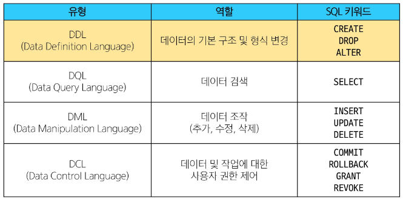

# Create a table

## CREATE TABLE

### CREATE TABLE 문법

- `CREATE TABLE` 문은 **새로운 테이블을 생성**할 때 사용한다.  
- 각 필드(열)에 적용할 **데이터 타입**을 지정한다.  
- 테이블 및 필드에 대한 **제약조건(constraints)** 을 작성한다.
  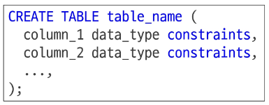
- 제약조건은 데이터의 **무결성(Integrity)** 을 보장하기 위해 사용된다.  

### 주요 제약조건 예시
- **PRIMARY KEY** : 기본 키 설정 (각 행을 고유하게 식별)
- **NOT NULL** : 비어 있는 값 허용 불가
- **UNIQUE** : 중복된 값 허용 불가
- **CHECK** : 특정 조건을 만족하는 데이터만 허용
- **DEFAULT** : 값이 지정되지 않았을 때 기본값 설정

  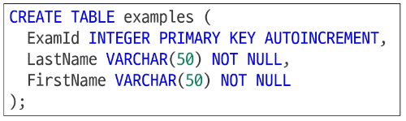

### PRAGMA

- **PRAGMA** 명령어는 데이터베이스의 **메타데이터(metadata)** 를 조회할 때 사용된다.  
- 특히 `PRAGMA table_info('테이블명');` 구문은 **테이블의 구조(schema)** 를 확인하는 데 사용된다.  
- 각 컬럼의 이름, 데이터 타입, 제약조건 등을 한눈에 확인할 수 있다.  

#### 예시 설명
- `PRAGMA table_info('examples');`  
  → `examples` 테이블의 각 필드 정보를 출력한다.  
  - **cid** : 컬럼의 고유 ID  
  - **name** : 컬럼 이름  
  - **type** : 데이터 타입  
  - **notnull** : NULL 허용 여부 (1이면 허용 안 함)  
  - **dflt_value** : 기본값(Default Value)  
  - **pk** : PRIMARY KEY 여부  

> **TIP**
> - `cid`는 **Column ID**를 의미하며, 각 컬럼의 고유 식별자를 나타내는 정수 값이다.  
> - 일반적으로 직접 사용하지 않으며, **PRAGMA 명령어의 결과에서 메타데이터 확인용**으로 활용된다.  

### 되돌아보기

- `PRAGMA`는 SQL에서 잘 사용되지 않지만, **SQLite 환경에서 테이블 구조를 빠르게 확인**할 수 있는 유용한 명령이다.  
- 컬럼명, 데이터 타입, 제약조건 등을 한 번에 파악하여 **데이터베이스 설계 및 디버깅 시 참고용**으로 활용할 수 있다.

---

### CREATE TABLE Statement 구성 (1/3) — 데이터 타입

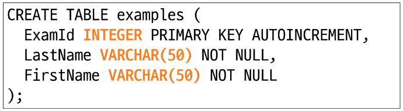

- 테이블을 생성할 때 각 컬럼에 **데이터 타입(Data Type)** 을 지정해야 한다.  
- 데이터 타입은 컬럼이 저장할 수 있는 **값의 형태와 크기**를 결정한다.  

#### 일반적인 예시  
1. **NULL**
- 아무런 값도 포함하지 않음을 나타냄  
- 값이 존재하지 않거나 정의되지 않은 상태를 표현  

2. **INTEGER**
- 정수형 데이터를 저장  
- 주로 식별자(ID)나 개수, 카운트 값 등에 사용  

3. **REAL**
- 부동 소수점(실수형) 데이터를 저장  
- 소수점이 포함된 값을 다룰 때 사용 (예: 가격, 비율 등)  

4. **TEXT**
- 문자열 데이터를 저장  
- 문자, 단어, 문장 등 텍스트 기반 데이터에 사용  

#### 5. BLOB
- **Binary Large Object**의 약자  
- 이미지, 동영상, 문서 등 **바이너리 데이터**를 저장하는 데 사용 
- 데이터 타입을 올바르게 설정하면 **메모리 효율성**과 **데이터 무결성**을 확보할 수 있다.

---

### CREATE TABLE Statement 구성 (2/3) — 제약 조건

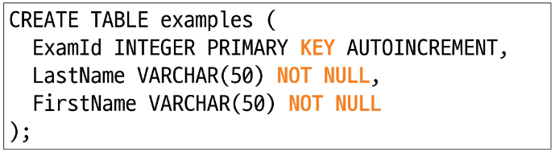

#### 제약 조건(Constraints)

- **제약 조건(Constraint)** 이란 테이블의 필드에 적용되는 **규칙 또는 제한 사항**을 의미한다.  
- 제약 조건을 통해 **데이터의 무결성(Integrity)** 을 유지하고, 데이터베이스의 **일관성(Consistency)** 을 보장할 수 있다.  

> 데이터의 무결성을 유지하고 데이터베이스의 일관성을 보장한다.

#### 대표 제약 조건 3가지

1. **PRIMARY KEY**
- 해당 필드를 **기본 키**로 지정한다.  
- 테이블 내에서 각 행을 **고유하게 식별**할 수 있다.  
- **INTEGER 타입**에만 적용되며, `INT`, `BIGINT` 등의 다른 정수형에는 적용되지 않는다.

2. **NOT NULL**
- 해당 필드에 **NULL 값을 허용하지 않도록 지정**한다.  
- 데이터 입력 시 반드시 값이 존재해야 함을 의미한다.

3. **FOREIGN KEY**
- **다른 테이블과의 관계를 정의**하기 위한 키이다.  
- 외래 키를 통해 두 테이블 간의 **참조 무결성(Referential Integrity)** 을 유지한다.

### CREATE TABLE Statement 구성 (3/3) — AUTOINCREMENT 키워드

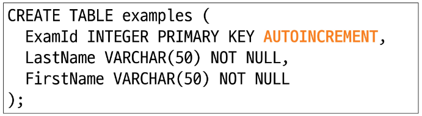

- **AUTOINCREMENT** 는 **PRIMARY KEY로 설정된 정수형 컬럼**에 사용되는 특수한 키워드이다.  
- 새로운 행이 추가될 때마다 **자동으로 고유한 번호가 1씩 증가**한다.  
- 주로 **기본 키(Primary Key)** 로 지정된 필드에 적용된다.  

#### 동작 방식
- `INTEGER PRIMARY KEY AUTOINCREMENT`로 지정된 컬럼은  
  항상 이전 레코드의 최대값보다 큰 값을 자동으로 할당받는다.  
- 삭제된 값은 무시되며, **이미 사용된 번호는 재사용할 수 없다.**  
- 즉, 한 번 부여된 식별자는 **영구적이며 중복되지 않는다.**

#### 사용 목적
- **ID를 자동으로 관리**하여 수동 입력의 번거로움을 줄인다.  
- **데이터의 일관성과 무결성**을 유지할 수 있다.  
- 새로운 데이터가 추가될 때마다 **고유한 식별자**를 자동으로 생성하므로  
  **편의성과 안정성**이 향상된다.

> `AUTOINCREMENT`는 데이터베이스에서 각 레코드의 **고유한 식별자**를 자동으로 생성하고,  
> 이미 사용된 값의 중복을 방지함으로써 데이터의 **신뢰성과 일관성**을 보장한다.

---

# Modifying table fields

## ALTER TABLE

### ALTER TABLE 역할

`ALTER TABLE` 문은 이미 존재하는 테이블의 **구조를 수정**할 때 사용된다.  
새로운 필드를 추가하거나, 이름을 변경하거나, 삭제할 때 활용된다.

#### 주요 명령어와 역할

| 명령어 | 역할 |
|:--|:--|
| **ALTER TABLE ADD COLUMN** | 필드 추가 |
| **ALTER TABLE RENAME COLUMN** | 필드 이름 변경 |
| **ALTER TABLE DROP COLUMN** | 필드 삭제 |
| **ALTER TABLE RENAME TO** | 테이블 이름 변경 |

#### 특징
- 테이블을 삭제하지 않고도 **구조를 변경**할 수 있다.  
- 데이터 손실 없이 필드를 추가하거나 이름을 수정할 수 있다.  
- 일부 데이터베이스에서는 `DROP COLUMN` 사용이 제한될 수 있으므로 주의해야 한다.

---

### ALTER TABLE ADD COLUMN

- `ALTER TABLE ADD COLUMN` 문은 **기존 테이블에 새로운 필드(열)를 추가**할 때 사용된다.  
- `ADD COLUMN` 키워드 뒤에 **추가할 필드 이름**, **데이터 타입**, **제약 조건**을 작성한다.  

#### 사용 시 주의사항
- 새로 추가하는 필드에 `NOT NULL` 제약조건이 있을 경우,  
  **NULL이 아닌 기본값(Default Value)** 을 반드시 설정해야 한다.  
- 이는 기존 레코드들에 새로운 필드가 추가될 때,  
  **값이 비어 있지 않도록 보장하기 위해서**이다.

#### 특징 요약
- 기존 데이터는 유지하면서 테이블 구조를 확장할 수 있다.  
- 데이터 무결성을 보장하기 위해 **제약조건과 기본값 설정**이 중요하다.  
- 데이터베이스를 재생성하지 않고도 테이블 구조를 **유연하게 변경**할 수 있다.

### 되돌아보기
- `ALTER TABLE ADD COLUMN`은 새로운 데이터 속성을 추가해야 할 때 유용하다.  
- 다만 `NOT NULL` 제약조건이 있는 경우 **기본값을 설정하지 않으면 오류가 발생**하므로 주의해야 한다.

---

# Delete a table

## DROP TABLE

### DROP TABLE 구문(syntax)

`DROP TABLE table_name;`

- DROP TABLE statement 이후 삭제할 테이블 이름 작성

### DROP TABLE 활용

- new_examples 테이블 삭제

`DROP TABLE new_examples;`

---

# Modifying Data

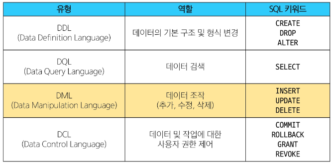

# Insert data

## INSERT

### INSERT syntax

- `INSERT INTO` 문은 **테이블에 새로운 레코드(행)를 삽입**할 때 사용된다.  
- 데이터를 추가하려는 **테이블 이름**과 **필드 목록**, 그리고 **삽입할 값 목록**을 지정해야 한다.  
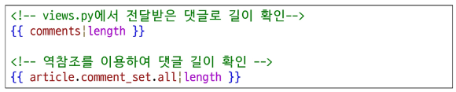

#### 구문 구조
- `INSERT INTO` 절 다음에는 테이블 이름과 괄호 안에 **필드 목록**을 작성한다.  
- `VALUES` 키워드 다음 괄호 안에는 **각 필드에 대응되는 값의 목록**을 작성한다.  

#### 특징
- 필드 목록을 지정하지 않으면, **테이블의 모든 필드 순서대로 값이 삽입**된다.  
- 필드 목록과 값의 개수는 반드시 **일치해야 한다.**  
- `NULL` 허용이 안 되는 필드(`NOT NULL`)에는 **값을 반드시 지정**해야 한다.

---

# Update data

## UPDATE

### UPDATE syntax

- `UPDATE` 문은 **테이블의 기존 레코드 값을 수정**할 때 사용된다.  
- 수정하려는 테이블 이름과 변경할 필드, 새로운 값을 지정해야 한다.  

#### 구문 구조 설명
- **SET 절**  
  - 수정할 **필드명**과 새로 지정할 **값(expression)** 을 작성한다.  
  - 여러 필드를 동시에 수정할 경우 쉼표(,)로 구분한다.  
- **WHERE 절 (선택 사항)**  
  - 수정할 레코드를 선택하는 **조건식**을 작성한다.  
  - WHERE 절을 작성하지 않으면 **모든 레코드가 수정**된다.  

#### 특징
- 데이터의 특정 부분만 선택적으로 변경 가능하다.  
- WHERE 절을 생략하면 전체 데이터가 변경될 수 있으므로 **항상 주의해서 사용**해야 한다.  
- 조건을 명확히 지정하지 않으면 **데이터 손실 또는 예기치 않은 수정**이 발생할 수 있다.  

### 되돌아보기
- `UPDATE` 문은 데이터 수정 시 자주 사용되지만,  
  WHERE 절을 정확히 작성하지 않으면 **모든 행이 변경되는 위험**이 있다.  
- 따라서 수정 전후 데이터를 확인하고, **트랜잭션을 통해 안전하게 실행**하는 습관이 필요하다.

---

# Delete data

## DELETE

### DELETE syntax

- `DELETE FROM` 문은 **테이블에서 특정 레코드(행)를 삭제**할 때 사용된다.  
- 삭제하려는 테이블 이름을 지정하고, 필요 시 삭제 조건을 작성한다.  

#### 구문 구조 설명
- **DELETE FROM 절**  
  - 삭제할 데이터를 포함한 **테이블 이름**을 지정한다.  
- **WHERE 절 (선택 사항)**  
  - 삭제할 레코드를 선택하는 **조건식**을 작성한다.  
  - WHERE 절을 작성하지 않으면 **모든 레코드가 삭제**된다.  

#### 특징
- 조건 없이 실행하면 테이블의 모든 데이터가 삭제되므로 **주의가 필요하다.**  
- 데이터베이스에서는 `DELETE` 문 실행 후 **ROLLBACK**을 통해 복구할 수 있는 경우도 있지만,  
  일반적으로 **데이터 손실 위험이 높다.**  
- 삭제 전 반드시 **WHERE 조건을 확인**해야 한다.  

### 되돌아보기
- `DELETE FROM` 문은 데이터베이스에서 불필요한 데이터를 제거할 때 사용된다.  
- 실수로 전체 데이터가 삭제되는 것을 방지하기 위해  
  항상 **조건문(WHERE)** 을 명확히 작성하고 **테스트 환경에서 검증 후 실행**하는 것이 중요하다.

---

# Multi table queries

## Join

### 관계의 필요성 (1/4)

- 커뮤니티 게시판에 필요한 데이터를 생각해보면, 하나의 테이블에 모든 정보를 담을 수 있다.  
- 예시 테이블에는 `id`, `title`, `content`, `writer`, `role` 필드가 포함된다.  
- 하지만 이러한 구조는 데이터 중복과 수정 시 비효율을 초래할 수 있다.  
  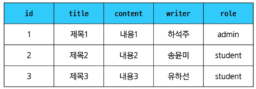

### 관계의 필요성 (2/4)

- 예를 들어, `'하석주'`가 작성한 모든 게시글을 조회하려고 할 때  
  `SELECT * FROM 테이블 WHERE writer = '하석주';` 구문을 사용할 수 있다.  
- 하지만 동일한 이름의 다른 사용자가 존재하거나, 사용자의 역할이 변경되면  
  **데이터 불일치 문제가 발생**할 수 있다.  

  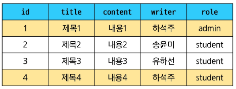

> 동일 인물이지만 역할이 다르게 저장되어 있어 데이터의 일관성이 깨짐

### 관계의 필요성 (3/4)

- 이러한 문제를 해결하기 위해 테이블을 나누어 **정규화(normalization)** 한다.  
- 각각의 테이블은 **하나의 주제**만 저장하도록 설계한다.  

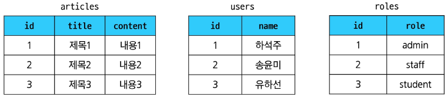

> 각 게시글이 누가 작성했는지, 작성자의 역할이 무엇인지 식별하기 위해  
> 테이블 간 관계 설정이 필요함.

### 관계의 필요성 (4/4)

- **articles**, **users**, **roles** 테이블 간 관계를 설정하기 위해  
  외래 키(`userId`, `roleId`)를 추가한다.  

#### 관계의 장점
- **관리 효율성** : 한 번의 수정으로 관련 데이터가 자동으로 반영됨  
- **데이터 일관성 유지** : 이름이나 역할이 변경되어도 참조된 모든 데이터에 적용됨  
- **중복 최소화** : 동일한 정보의 반복 저장을 방지  

> 예를 들어,  
> - 관리자만 보고 싶다면 → `roleId`가 1인 데이터만 조회  
> - ‘하석주’를 ‘권미숙’으로 변경하면 → `users` 테이블에서 한 번만 수정하면 됨

---

### JOIN이 필요한 순간

- 테이블을 분리하면 데이터 관리가 **효율적**이고 **중복을 최소화**할 수 있다.  
- 하지만 데이터를 출력할 때는,  
  **하나의 테이블만으로는 필요한 정보를 모두 표시하기 어려운 경우**가 발생한다.  
- 예를 들어, 게시글 정보와 작성자 정보를 함께 보여주려면  
  서로 다른 테이블을 **결합(join)** 해야 한다.  

> 이때 사용하는 것이 바로 **JOIN** 이다.

> TIP
> - 테이블을 분리하는 이유  
>   - 데이터 중복을 줄이고, 수정·삭제가 쉬워지도록 하기 위함  
>   - 예: 사용자 정보와 주문 정보를 분리 저장  
> 
> - 그러나 실제 출력에서는  
>   - 사용자 이름과 주문 내역처럼 서로 다른 테이블의 데이터를  
>     함께 보여줘야 하는 경우가 많음  
>   - 이럴 때 **분리된 테이블을 다시 묶어주는 기능**이 바로 `JOIN`  

---

### JOIN 종류

#### 1. INNER JOIN
- **양쪽 테이블에 공통된 값이 존재하는 행만 결합**한다.  
- 즉, **조건에 일치하는 데이터만 조회**되는 방식이다.  

#### 2. LEFT JOIN
- **왼쪽(기준) 테이블의 모든 데이터**를 출력하고,  
  오른쪽 테이블의 데이터는 **조건에 맞는 경우만 결합**된다.  
- 만약 오른쪽 테이블에 일치하는 데이터가 없다면,  
  해당 부분은 **NULL 값으로 표시**된다.  

---

# Joining tables

## INNER JOIN

### INNER JOIN syntax

- `INNER JOIN`은 **두 테이블에서 일치하는 값이 존재하는 레코드만 결합**하는 방식이다.  
- 즉, **공통된 데이터만 결과로 반환**한다.  
- 교집합(Intersection)의 개념과 유사하다.  

#### 구성 요소 설명
- **FROM 절**  
  - 기준이 되는 메인 테이블을 지정한다. (예: `table_a`)  
- **INNER JOIN 절**  
  - 메인 테이블과 조인할 다른 테이블을 지정한다. (예: `table_b`)  
- **ON 키워드**  
  - 두 테이블을 연결할 **조인 조건**을 명시한다.  
  - 예: `ON table_b.fk = table_a.pk`  
  - 이때 조건은 두 테이블의 **공통 필드(기본키와 외래키 관계)** 를 일치시킨다.  

#### 특징
- 조건에 일치하는 행만 결과로 출력되며,  
  어느 한쪽 테이블이라도 일치하지 않으면 해당 데이터는 제외된다.  
- 주로 **관계형 데이터의 교집합을 조회할 때** 사용된다.  

#### 예시 상황
- 게시글(`articles`)과 작성자(`users`) 테이블을 연결해  
  **작성자 이름과 게시글 제목을 함께 출력**할 때 유용하다.  
- 주문(`orders`)과 고객(`customers`) 테이블을 결합해  
  **주문이 존재하는 고객 목록만 확인**할 때 사용된다.  

## LEFT JOIN

### LEFT JOIN syntax

- `LEFT JOIN`은 **왼쪽 테이블의 모든 데이터**를 기준으로,  
  오른쪽 테이블의 일치하는 데이터를 결합하는 방식이다.  
- 일치하지 않는 경우에도 **왼쪽 테이블의 데이터는 모두 유지**되며,  
  오른쪽 테이블의 값은 **NULL**로 표시된다.  

#### 구성 요소 설명
- **FROM 절**  
  - 기준이 되는 **왼쪽 테이블(table_a)** 을 지정한다.  
- **LEFT JOIN 절**  
  - 왼쪽 테이블과 조인할 **오른쪽 테이블(table_b)** 을 지정한다.  
- **ON 키워드**  
  - 두 테이블의 데이터를 연결할 **조인 조건**을 작성한다.  
  - 예: `ON table_b.fk = table_a.pk`  
  - 왼쪽 테이블의 각 레코드를 오른쪽 테이블의 조건에 맞는 레코드와 일치시킨다.  

#### 특징
- 왼쪽 테이블의 모든 행이 결과에 포함된다.  
- 오른쪽 테이블에서 일치하는 데이터가 없을 경우, 해당 컬럼 값은 **NULL**이 된다.  
- 주로 **데이터 누락 없이 전체 목록을 조회해야 하는 경우**에 사용된다.  

#### 예시 상황
- 모든 사용자의 목록을 출력하면서, 게시글이 없는 사용자도 함께 표시할 때  
- 모든 상품을 조회하되, 주문되지 않은 상품도 결과에 포함시키고 싶을 때  

### LEFT JOIN 특징

- **왼쪽 테이블의 모든 레코드를 출력**한다.  
- 오른쪽 테이블과 매칭되는 레코드가 없을 경우,  
  해당 컬럼 값은 **NULL**로 표시된다.  

> 즉, 왼쪽 테이블을 기준으로 데이터를 전부 보여주되,  
> 오른쪽 테이블에서 일치하는 값이 없으면 NULL로 채운다.

> TIP
> - **LEFT JOIN은 왼쪽 테이블 기준으로 모든 데이터를 보여주는 조인**이다.  
>   - 왼쪽 테이블의 모든 행은 **무조건 출력**된다.  
>   - 오른쪽 테이블에 일치하는 데이터가 없으면 **NULL**로 표시된다.  
> - **활용 예시**
>   - 어떤 데이터가 **존재하지 않는지 확인**하고 싶을 때 유용하다.  
>   - 예: “회원 중 아직 주문을 한 번도 하지 않은 사람 찾기”  

