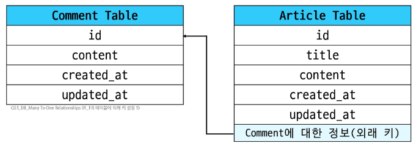
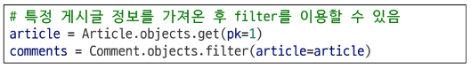
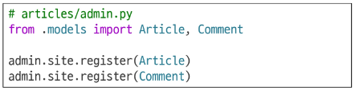
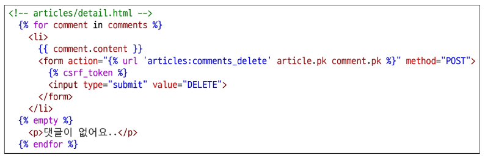
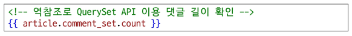

# Many to one relationships

## 모델 관계

### 관계(relationship)의 정의

**관계(relationship)**란  
데이터베이스 내 여러 테이블 간의 **논리적인 연결 관계**를 의미한다.

>데이터베이스에는 ‘강사’ 테이블과 ‘학생’ 테이블이 있을 때,  
>“이상명 강사가 김싸피 학생을 가르치고 있다”는 정보를 저장하려면  
>두 테이블 간의 관계(relationship)를 설정해야 한다.
>
>이러한 관계를 표현하기 위해, 한 테이블에 다른 테이블의 기본 키(Primary Key)를 저장하며  
>이처럼 다른 테이블의 기본 키를 참조하는 속성을 **외래 키(Foreign Key)** 라고 한다.
>
>외래 키는 두 테이블 간의 논리적인 연결 고리 역할을 하며,  
>이를 통해 관계형 데이터베이스에서 연관된 데이터를 효율적으로 관리할 수 있다.

### 관계의 종류

| 관계 유형 | 설명 | 예시 | 특징 |
|:--|:--|:--|:--|
| **1:1 (One to One)** | 한 테이블의 레코드는 다른 테이블의 **한 레코드와만 연결**됨 | 한 사람 ↔ 하나의 주민등록번호 | 주로 상세 정보 분리 시 사용됨 |
| **N:1 (Many to One)** | 여러 개의 레코드가 **하나의 레코드와 연결**됨 | 여러 교육생(N) ↔ 한 강사(1) | 가장 일반적인 관계, 외래 키(Foreign Key) 사용 |
| **N:M (Many to Many)** | 여러 레코드가 **여러 레코드와 상호 연결**됨 | 여러 학생(N) ↔ 여러 과목(M) | 중간 테이블(예: 수강신청)로 구현됨 |

### Many to One Relationships

**N:1 또는 1:N 관계**란  
한 테이블의 **0개 이상의 레코드**가  
다른 테이블의 **레코드 한 개와 관련된 관계**를 의미한다.

즉, 여러 개의 데이터(다수)가 하나의 데이터(단수)에 속하는 구조로,  
관계형 데이터베이스에서 매우 자주 사용되는 형태이다.

### Many to One Relationships 예시

| 예시 | 관계 형태 | 설명 |
|:--|:--|:--|
| **SSAFY Track (1) : Student (N)** | 하나의 트랙에는 여러 명의 교육생이 포함됨 | 한 명의 교육생은 트랙이 중복될 수 없음 |
| **Account (N) : Bank (1)** | 하나의 계좌는 한 은행에만 소속 | 한 은행은 여러 개의 계좌를 가질 수 있음 |
| **Baseball Team (1) : Member (N)** | 한 팀에 여러 명의 선수가 소속 | 한 선수가 여러 팀에 속할 수 없음 |
| **Order (N) : Customer (1)** | 한 명의 고객이 여러 주문 가능 | 하나의 주문을 여러 고객이 낼 수 없음 |
| **Country (1) : City (N)** | 하나의 국가는 여러 도시를 가짐 | 한 도시는 중복된 국가에 포함되지 않음 |
| **Movie (N) : Actor (M)** | 영화에 여러 배우가 출연, 배우도 여러 영화에 출연 가능 | → **N:M 관계**, N:1 관계 아님 |

---

### 댓글과 게시글의 관계

**Comment(N) : Article(1)**

  
하나의 게시글(Article)에 여러 개의 댓글(Comment)이 달릴 수 있는 구조를 의미합니다.  

즉, **0개 이상의 댓글이 1개의 게시글에 작성될 수 있는 관계**입니다.

- 하나의 게시글에는 여러 개의 댓글이 달릴 수 있음  
- 단, 게시글에 댓글이 없더라도 게시글은 존재할 수 있음  
- 반면, 댓글이 소속된 게시글이 없는 경우는 존재하지 않음  

이처럼 **댓글은 반드시 하나의 게시글에 속해야 하는 종속 관계**를

---

### 테이블 관계 설정

#### 관계 설정 시 주의점

관계를 설정하기 위해 사용하는 **Foreign Key(외래 키, FK)** 는  
**N:1 관계에서 ‘N’을 담당하는 테이블에 위치**해야 한다.  

만약 `Article Table`(1)에 `Foreign Key` 컬럼을 두면,  
댓글(Comment)이 여러 개 존재할 때마다 같은 게시글 정보(`id`, `title`, `content` 등)이  
**중복 저장**되어 데이터 낭비가 발생하게 된다.

즉, 댓글이 생성될 때마다 `Article`의 정보를 함께 저장하면  
**매번 중복된 데이터가 쌓이는 비효율적인 구조**가 된다.

#### 관계 설정의 올바른 위치

`Foreign Key`는 **N 쪽 테이블**, 즉 `Comment Table`에 위치해야 한다.  
이렇게 하면 댓글이 생성될 때, 게시글 전체 정보를 저장하는 대신  
**참조 관계(외래 키)** 만 저장하게 된다.

따라서 `Comment Table`에는 `Article`의 `Primary Key(PK)` 값이 저장되며,  
이를 통해 댓글이 어떤 게시글에 속하는지를 구분할 수 있다.

💡 **정리**
- 외래 키(Foreign Key)는 **N 쪽 테이블**에 위치한다.  
- 외래 키는 참조 대상 테이블의 **기본 키(Primary Key)** 값을 저장한다.  
- 이렇게 함으로써 **데이터 중복을 방지하고**,  
  **게시글–댓글 간의 관계를 효율적으로 관리**할 수 있다.

## 댓글 모델 정의

### ForeignKey 필드

`ForeignKey(to, on_delete)`는  
한 모델이 다른 모델을 **참조하는 관계를 설정**하는 필드이다.

- 이 필드는 **N:1 관계를 표현할 때 사용**하며,  
- 데이터베이스에서는 실제로 **외래 키(Foreign Key)** 로 구현된다.

즉, 한 테이블의 여러 데이터가  
다른 테이블의 하나의 데이터를 참조해야 할 때  
`ForeignKey`를 통해 두 모델 간의 연결 관계를 정의한다.

### ForeignKey(to, on_delete)

`ForeignKey`는 한 모델이 다른 모델을 참조하도록 관계를 설정하는 필드이다.  
`to`와 `on_delete` 속성은 이 필드 설정 시 **필수 요소**이다.

#### 🔹 to 속성
- 참조하는 모델의 **class 이름**을 지정한다.  
- N:1 관계에서 **N이 아닌 1의 클래스 정보**를 나타낸다.

#### 🔹 on_delete 속성
- 외래 키가 참조하는 객체(1)가 삭제될 때,  
  그 객체를 참조하고 있는 다른 객체(N)를 **어떻게 처리할지 정의**하는 설정이다.  
- 이는 데이터의 **무결성(Integrity)** 을 유지하기 위한 필수 개념이다.  
  즉, 데이터가 정확하고 일관되게 유지되도록 보장하는 역할을 한다. (<u>데이터 무결성</u>)

### on_delete 속성 종류

- **`CASCADE`** → _수업에서 사용할 속성!_   
  참조된 객체(부모 객체)가 삭제되면 이를 참조하는 모든 객체도 함께 삭제되도록 지정한다.  
  예: 게시글이 삭제되면 해당 게시글의 모든 댓글도 함께 삭제된다.

- **`PROTECT`**  
  자식 객체가 존재할 경우 부모 객체의 삭제를 막는다.  
  예: 게시글에 댓글이 남아 있다면 게시글을 삭제할 수 없다.

- **`SET_NULL`**  
  부모 객체가 삭제되면 외래 키 필드의 값이 `NULL`로 변경되도록 지정한다.  
  단, 이 경우 `ForeignKey` 필드에 `null=True` 옵션을 함께 설정해야 한다.

---

### 댓글 모델 정의하기

`ForeignKey` 필드의 인스턴스 이름은  
참조하는 모델 클래스 이름의 **단수형**으로 작성하는 것을 권장한다.  

#### 단수형으로 이름을 작성하는 이유
- 단일 객체를 참조하므로 속성명을 단수형으로 작성하면 의미가 명확해진다.  
- 코드 작성 시 문맥이 자연스러워진다.  

- 예를 들어, 댓글(Comment)이 특정 게시글(Article)을 참조할 때  
  `articles`처럼 복수형을 사용하면 여러 게시글을 참조하는 것처럼 보이므로  
  `article`처럼 단수형으로 작성하는 것이 올바르다.
  

---

### Migration 이후 댓글 테이블 확인

#### 만들어지는 필드 이름 규칙
`ForeignKey`로 작성한 외래 키 필드는 실제 데이터베이스에  
**‘작성한 외래 키 필드명’ + _id** 형태로 생성된다.  
예를 들어, `article`이라는 외래 키 필드를 작성하면  
테이블에는 `article_id`라는 필드가 생성된다.

#### 댓글 테이블의 외래 키 필드 확인
- `article_id`는 **bigint 자료형**으로 생성된다.  
- 이는 외래 키가 참조하는 대상 테이블의 기본 키(Primary Key)가  
  `bigint` 자료형으로 되어 있기 때문이다.

#### 단수형 이름 권장 이유의 실제 반영
참조하는 클래스 이름을 **소문자 단수형**으로 작성하는 것이 권장된 이유가 바로 여기에 있다.  
외래 키가 자동으로 `_id`가 붙은 필드명으로 변환되므로,  
단수형으로 작성하면 데이터베이스 컬럼명이 자연스럽고 명확하게 표현된다.

💡 **참고**
- 외래 키는 `models.py` 파일 내에서 작성된 순서와 관계없이  
  **테이블의 마지막 필드로 생성**된다.

## 댓글 생성 연습

실습 참고!

---

# 관계 모델 참조

### 참조의 정의

**참조**란 직접 대상의 정보를 저장하고 필요할 때 활용하는 것을 의미한다.  

이는 마치 “내가 친구의 전화번호를 저장해두는 것”과 같다.  
내가 친구의 번호를 알고 있기 때문에 언제든지 친구에게 전화하거나 문자를 보낼 수 있는 것처럼,  
데이터베이스에서도 참조 관계를 통해 다른 테이블의 정보를 손쉽게 불러올 수 있다.

실제 예시로, **댓글(Comment)** 은 **게시글(Article)** 정보를 저장하는  
`ForeignKey` 필드인 `article`을 가지고 있다.  
이를 통해 댓글 객체는 게시글의 정보를 직접 참조하며,  
필요할 때 게시글의 내용에 접근할 수 있다.  

즉, **댓글(Comment)은 게시글(Article)을 참조한다**고 표현한다.

예시) 댓글이 연결된 게시글의 내용에 접근할 때  
`comment.article.content`

### 특정 게시글(Article)의 댓글(Comment) 정보 조회하기

#### QuerySet API의 `.all()` 사용은 비추천

`.all()` 메서드를 사용하면 특정 게시글에 달린 댓글만이 아니라  
**모든 댓글(Comment) 정보**를 가져오게 된다.  
즉, 원하는 게시글의 댓글만 조회할 수 없으므로 비효율적인 방법이다.

#### QuerySet API의 `.filter()` 사용하기

특정 게시글의 정보를 먼저 가져온 뒤,  
`filter()`를 이용해 그 게시글에 해당하는 댓글만 조회할 수 있다.  

예를 들어, 특정 게시글을 식별한 후  
해당 게시글을 참조하고 있는 댓글들만 필터링하는 방식이다.  

이 방법을 사용하면 **원하는 게시글에 속한 댓글만 선택적으로 조회**할 수 있다.

## 역참조

### 역참조의 정의

**역참조**란 “누가 나를 참조하는지 거꾸로 조회하는 것”을 의미한다.  
이는 마치 “내 전화번호를 저장한 사람이 누구인지 찾는 것”과 비슷한 개념이다.

직접적으로 정보를 가지고 있지 않고,  
반대로 **참조하는 대상을 역으로 찾아야 하기 때문에** 이를 **역참조**라고 부른다.

예를 들어, 게시글(Article) 입장에서는 연결된 댓글(Comment) 정보를 담는 필드가 존재하지 않는다.  
따라서 게시글이 자신을 참조하고 있는 댓글들을 **거꾸로 찾아야** 하며,  
이 과정을 Django에서는 자동으로 처리할 수 있도록 **역참조 기능**을 제공한다.

즉, Django는 게시글(Article)에 달린 댓글(Comment)을  
직접적인 참조 없이도 손쉽게 추적하고 조회할 수 있도록  
자동화된 관계 접근 방법(매니저)을 지원한다.

### 역참조 기본 구조

`article.comment_set.all()`  
특정 게시글(Article)에 작성된 **댓글(Comment) 전체를 조회하는 요청**이다.  
이 구조는 **모델 인스턴스 + related manager(역참조 이름) + QuerySet API** 로 이루어진다.

#### 1️⃣ 모델 인스턴스 `article`.comment_set.all()
- `models.py`에 정의된 모델 클래스로부터 생성된 실제 데이터를 의미한다.  
- 예를 들어, `article.title`과 같이 속성에 접근하고 수정할 수 있다.  
- 역참조에서는 참조 가능한 필드가 없는 **모델 클래스의 인스턴스**를 사용한다.  
  즉, `Article(1) : Comment(N)` 관계에서는 `Article`이 댓글을 직접 참조하는 필드가 없으므로  
  `Article`의 인스턴스를 통해 역참조를 수행한다.  

👉 특정 게시글에 작성된 댓글 전체를 조회하는 방식이다.

#### 2️⃣ related manager (역참조 이름) article.`comment_set`.all()
- `related manager`는 **N:1 또는 N:M 관계에서 역참조 시 사용하는 매니저**를 의미한다.  
- `objects` 매니저를 통해 QuerySet API를 사용하듯이,  
  `related manager`를 통해서도 같은 방식으로 QuerySet API를 사용할 수 있다.  
- Django는 기본적으로 역참조 이름을 **`모델명_set`** 형태로 자동 지정한다.  
  예: `article.comment_set`

👉 이를 활용하면 **게시글에 연결된 댓글 전체를 역참조로 조회**할 수 있다.

#### 3️⃣ QuerySet API article.comment_set.`all()`
- 데이터를 가져오기 위한 **쿼리 결과 집합을 만드는 인터페이스**이다.  
- SQL 문을 직접 작성하지 않아도 Django ORM을 통해 데이터베이스를 조작할 수 있다.  
- `.all()`은 해당 관계에 포함된 모든 객체를 불러오는 메서드이다.

👉 결과적으로 `article.comment_set.all()`은  
특정 게시글에 달린 모든 댓글을 **한 번에 가져오는 ORM 명령**이다.

### related manager (역참조 이름) 이름 규칙

- Django는 **모델 클래스명 + `_set`** 형태의 기본 값을 자동으로 생성한다.  
  즉, 역참조를 위한 별도의 설정을 하지 않아도  
  Django가 관계를 자동으로 인식하고 객체를 조회할 수 있도록 한다.

- 이렇게 생성된 역참조 이름은  
  관계가 직접 정의되지 않은 모델에서도 **연결된 객체를 거꾸로 조회**할 수 있게 해준다.

#### 🔹 참조 (Comment → Article)
특정 댓글이 어떤 게시글에 달렸는지를 조회할 때 사용한다.  
예: `comment.article`

#### 🔹 역참조 (Article → Comment)
특정 게시글에 달린 모든 댓글 목록을 조회할 때 사용한다.  
예: `article.comment_set.all()`

이처럼 Django의 기본 규칙에 따라 `_set`이 붙은 이름은  
모델 간의 관계를 거꾸로 탐색하기 위한 **기본 역참조 접근 방식**이다.

---

# 참고

## 데이터 무결성

### 데이터 무결성이란

**데이터 무결성**이란  
데이터베이스에 저장된 데이터의 **정확성**, **일관성**, **유효성**을 유지하는 것을 의미한다.  
즉, 데이터베이스에 저장된 데이터의 값이 **정확하게 유지되고 변형되지 않도록 보장**하는 것.

#### 🔹 중요성
- **데이터의 신뢰성 확보**: 잘못된 정보 없이 항상 올바른 데이터를 유지할 수 있다.  
- **시스템 안정성 향상**: 데이터 간의 관계가 일관되게 유지되어 오류를 줄인다.  
- **보안 강화**: 무결성을 유지하면 불필요한 데이터 조작이나 손상을 방지할 수 있다.

---

## admin site 댓글 등록

---

## 댓글 추가 구현

### 댓글이 없는 경우 대체 콘텐츠 출력

#### 🔹 DTL의 `for empty` 태그 활용
`for` 문에 반복할 요소가 없을 경우,  
`empty` 태그가 실행되어 대체 콘텐츠를 출력한다.  

이 기능을 활용하면, 댓글 목록이 비어 있을 때  
사용자에게 “댓글이 없습니다”와 같은 메시지를 보여줄 수 있다.

이 방식은 사용자 경험(UX)을 향상시키며,  
빈 데이터 상태에서도 페이지가 자연스럽게 보이도록 도와준다.

### 댓글 개수 출력하기

댓글의 총 개수를 확인하는 방법은 두 가지가 있다.

#### 🔹 1. DTL filter의 `length` 활용

- `{{ comments|length }}`  
  → 뷰에서 전달받은 댓글 목록의 개수를 계산한다.  
- `{{ article.comment_set.all|length }}`  
  → 역참조를 통해 특정 게시글에 달린 댓글 개수를 계산한다.

#### 🔹 2. QuerySet API의 `count()` 메서드 활용

- `{{ article.comment_set.count }}`  
  → 데이터베이스에서 직접 댓글 개수를 세어 반환한다.

`|length`는 템플릿 내부에서 즉시 확인할 때 유용하고,  
`count()`는 데이터베이스 연산으로 처리되어 성능 면에서 효율적이다.
